# Predicting House Sale Prices with Statistical Modeling and Neural Networks

**Project Report**

- **Student 1:** Gayakpa Kenny — 22510580
- **Student 2:** Khaireddine Gatti - 17832155

*Computational Statistics — Spring 2026 — May 27, 2026*

## Abstract

This report presents a statistical and machine-learning analysis of the Kaggle *House Prices — Advanced Regression Techniques* dataset, which describes 1460 residential homes in Ames, Iowa through 79 explanatory variables. The work is organised in five complementary parts, applied in parallel on three target scales (`SalePrice`, `SalePrice_Log`, `SalePrice_BoxCox`) to assess the robustness of every conclusion across transformations.

We first characterise the distribution of `SalePrice` through classical inference (descriptive statistics, 95% confidence intervals, one-sample t-tests against $180,000, Shapiro–Wilk normality tests), confirming the strong right-skew that motivates the `log1p` and Box–Cox transformations. We then identify the ordinal features that significantly influence price via one-way ANOVA, and quantify pairwise interactions through a two-way ANOVA assisted by Tukey HSD post-hoc tests and a structural level-merging strategy. A 2³ factorial design on three dominant factors decomposes the price structure into main effects and interactions. A linear regression model (OLS, with Ridge and Lasso comparisons) built on the significant features supplemented by `GrLivArea` and `TotalBsmtSF` reaches R² ≈ 0.82. Finally, a multi-layer perceptron trained on all 79 features and tuned via 3-fold cross-validated grid search achieves a CV RMSE of 0.1821 on the log scale and a Kaggle public leaderboard RMSE of 0.15591, surpassing both the OLS benchmark and the CV estimate. The convergence of feature rankings across parametric and non-parametric methods (`GrLivArea`, `OverallQual`, and `KitchenQual` dominate every method) confirms the robustness of the structural conclusions, while the modest gain of the MLP over OLS indicates that the bulk of the predictive signal is already captured by a small number of dominant features.

---

## Contents

1. [Introduction](#1-introduction)
2. [Data and Preprocessing](#2-data-and-preprocessing)
3. [Classical Statistical Inference](#3-classical-statistical-inference)
4. [ANOVA for Ordinal Features](#4-anova-for-ordinal-features)
5. [2^k Factorial Design](#5-2k-factorial-design)
6. [Parametric Regression](#6-parametric-regression)
7. [Neural-Network Regression](#7-neural-network-regression)
8. [Conclusion](#8-conclusion)
9. [Individual Contributions](#individual-contributions)

---

## 1 Introduction

### What the project is about

This project tackles a classic problem in applied statistical learning: predicting the sale price of residential houses. The work is built on the *House Prices — Advanced Regression Techniques* dataset hosted on Kaggle, which describes the residential real estate. The objective is twofold: first, to understand which factors genuinely drive the price of a house through a thorough statistical analysis; second, to build a predictive model capable of generalising to unseen houses, whose predictions are submitted to Kaggle and evaluated through the RMSE.

More broadly, the project serves as a framework for applying a coherent set of statistical and machine-learning techniques: classical inference, analysis of variance, factorial experimental design, parametric regression, and a non-parametric neural network model. Each method answers a distinct question about the data, and their progressive articulation forms the backbone of the project.

### Outline of the project

The work is organised into five parts.

**Part 1 — Classical statistical inference.** We begin by characterising the distribution of `SalePrice` (mean, variance, 95% confidence interval), then formally test several hypotheses: does the mean differ from $180,000? Is the distribution normal (Shapiro–Wilk test)? This part also introduces the two transformations (`log1p` and Box–Cox) that will serve as alternative targets throughout the rest of the project.

**Part 2 — ANOVA and identification of significant features.** Out of ten candidate variables, we identify via a one-way ANOVA those that have a statistically significant effect on price. We then proceed with a two-way ANOVA to detect interactions between pairs of variables, relying on Tukey HSD post-hoc tests and a level-merging strategy.

**Part 3 — 2³ Factorial Design.** We binarise three of the significant factors to build a 2³ experimental design. This compact structure allows the price to be decomposed into main effects, two-way interactions, and the three-way interaction, and to visually identify the couplings between factors through interaction plots.

**Part 4 — Parametric regression.** We build a linear regression model (OLS) using the significant ordinal features, supplemented by two numerical variables (`GrLivArea`, `TotalBsmtSF`). The analysis covers the coefficients, their p-values, residual diagnostics, and a comparison with the regularised Ridge and Lasso variants.

**Part 5 — Non-parametric model (neural network).** The final part leverages all 79 available variables to train a multi-layer perceptron (MLP). We build a complete preprocessing pipeline (imputation, one-hot encoding, standardisation), tune the hyperparameters via `GridSearchCV`, analyse the residuals of the final model, and generate the `submission.csv` file submitted to Kaggle.

Three scales of the target (`SalePrice`, `SalePrice_Log`, `SalePrice_BoxCox`) are kept in parallel across Parts 1 to 4, allowing every step to compare the robustness of conclusions across transformations.

---

## 2 Data and Preprocessing

### 2.1 Data Source

The dataset used in this project is the *House Prices — Advanced Regression Techniques* corpus, hosted by Kaggle [2]. The data is delivered in two CSV files:

- **`train.csv`** — 1460 houses, each accompanied by 81 columns: a unique identifier `Id`, the target variable `SalePrice` (the actual sale price in US dollars), and 79 explanatory variables.
- **`test.csv`** — 1459 houses described by the same 79 explanatory variables, but without the `SalePrice` column. These are the houses for which a prediction must be produced.

The split between training and test sets is fixed by Kaggle and cannot be modified — the test set is the official evaluation set against which submissions are scored. The evaluation metric is the Root Mean Squared Error (RMSE) computed on the logarithm of the predicted price.

The 79 explanatory variables describe (almost) every aspect of residential homes. Of these, **36 are numerical** (`int64`, `float64`) and **43 are categorical** (`object`). The categorical variables are predominantly ordinal quality scales (e.g., `Po`, `Fa`, `TA`, `Gd`, `Ex`), with some nominal attributes such as `Neighborhood` (25 distinct levels — the highest cardinality of the dataset). Numerical variables include surfaces (`GrLivArea`, `TotalBsmtSF`, `LotArea`), counts, and years.

### 2.2 Preprocessing Decisions

#### Handling the target variable

The variable `SalePrice` is heavily right-skewed (skewness = 1.883). Since most statistical methods used in this project (t-tests, ANOVA, OLS regression) and the Kaggle evaluation metric itself assume approximate symmetry on the target, a transformation that brings the distribution closer to a bell curve is needed. Two candidates are evaluated and kept in parallel throughout Parts 1 to 4.

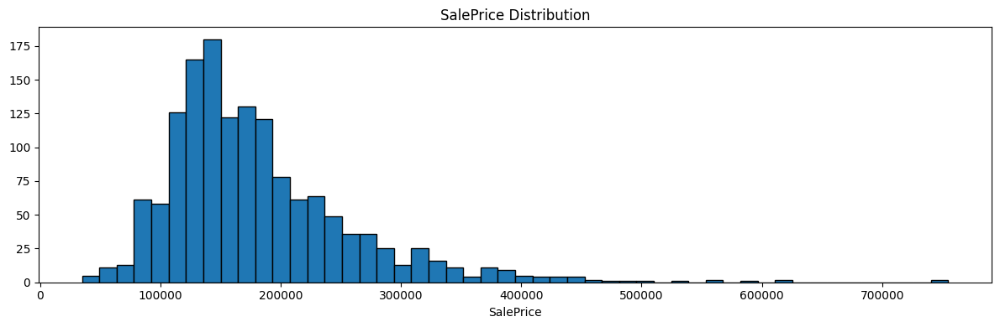

*Figure 1: Distribution of `SalePrice` on the training set. The histogram shows the strong right-skew (skewness = 1.883) that motivates the use of the `log1p` and Box–Cox transformations.*

**The logarithmic transformation (`log1p`).** The logarithm compresses large numbers much more aggressively than small ones, which is exactly what a right-skewed distribution needs.

- **Formula:** $y = \ln(1 + x)$
- **Why `log1p` instead of `log`:** the +1 shift avoids the singularity of $\ln(0)$, since the natural logarithm is undefined at zero.
- **Effect:** very high prices (the right tail) are pulled toward the centre of the distribution, producing a roughly symmetrical bell curve.

To recover dollar amounts from a log-transformed prediction, we invert the operation using the exponential function:

- **Inverse formula:** $x = e^y - 1$
- **In Python:** `np.expm1(log_value)`

**The Box–Cox transformation.** Unlike the logarithm, Box–Cox does not rely on a single fixed formula. Instead, it searches for the power $\lambda$ that makes the transformed data as normal as possible.

- **Formula:**

$$y = \begin{cases} \dfrac{x^\lambda - 1}{\lambda} & \text{if } \lambda \neq 0 \\ \ln(x) & \text{if } \lambda = 0 \end{cases}$$

- **Logic:** the algorithm tests many candidate values of $\lambda$ and retains the one that brings the transformed data closest to a normal distribution.

The inverse transformation is:

- **Inverse formula:** $x = (y \cdot \lambda + 1)^{1/\lambda}$
- **In Python:** `scipy.special.inv_boxcox(bc_value, lmbda)`

**How the algorithm finds the optimal λ.** The procedure proceeds in three logical steps:

1. **The "best score" test (likelihood).** For each candidate value of $\lambda$, the algorithm computes a score on the transformed data. The closer the transformed distribution is to a normal one, the higher the score.
2. **Searching for the peak.** The algorithm adjusts $\lambda$ incrementally until it locates the value that produces the highest possible score.
3. **Two validation objectives.** A correct $\lambda$ should produce a distribution that satisfies two properties simultaneously: **symmetry** (skewness close to 0) and **balance** (a reduced gap between small and large values).

On our `SalePrice` data, the search yields $\lambda \approx -0.0769$. A $\lambda$ of exactly 0 would be equivalent to a pure logarithm, so a $\lambda$ of $-0.0769$ means the data needed a transformation only slightly stronger than `log1p` to reach near-perfect symmetry.

**Comparative demonstration.** The table below shows how both methods transform a representative sample of price levels. Both compress the gap between cheap and expensive houses, but Box–Cox (with $\lambda = -0.0769$) is slightly more aggressive on the high end. The rightmost column confirms that the inverse transformation recovers the original price exactly in both cases.

| House Type | Original Price (x) | y_log | y_bc | Return Accuracy |
|---|---|---|---|---|
| Entry-level | $50,000 | 10.8198 | 7.3342 | $50,000 |
| Average Price (Target) | $180,000 | 12.1007 | 7.8672 | $180,000 |
| High-end | $350,000 | 12.7657 | 8.1311 | $350,000 |
| Luxury (Outlier) | $500,000 | 13.1224 | 8.2444 | $500,000 |
| Ultra-Luxury | $750,000 | 13.5278 | 8.4005 | $750,000 |

**Detailed calculation example.** Consider a house priced at exactly $300,000 and follow each step of the round-trip.

*Case A — Logarithm (`log1p`).*

1. **Transformation:** $y = \ln(1 + 300{,}000) \approx 12.6115$
2. **Reverse (return to price):**
   - $x = e^{12.6115} - 1$
   - $x = 300{,}001 - 1 = \$300{,}000$

*Case B — Box–Cox (with $\lambda = -0.0769$).*

1. **Transformation:**
   - $y = \dfrac{300{,}000^{-0.0769} - 1}{-0.0769}$
   - $300{,}000^{-0.0769} \approx 0.37985$
   - $y = \dfrac{0.37985 - 1}{-0.0769} = \dfrac{-0.62015}{-0.0769} \approx 8.0644$
2. **Reverse (return to price):**
   - $x = (8.0644 \cdot -0.0769 + 1)^{1/-0.0769}$
   - $x = (-0.62015 + 1)^{-13.0039}$
   - $x = (0.37985)^{-13.0039} \approx \$300{,}000$

**Applying the transformations to the data.** Having defined both transformations theoretically, we now apply them to the `SalePrice` column and inspect the result. The code creates the two new variables `SalePrice_Log` and `SalePrice_BoxCox`, computes the skewness on each scale to verify the effect of each transformation, and produces a three-panel histogram comparing the original distribution against its two normalised counterparts.

From this point on, the two transformed variables `SalePrice_Log` and `SalePrice_BoxCox` are kept alongside the original `SalePrice` as three parallel targets across Parts 1 to 4. For Part 5 (neural network), only `SalePrice_Log` is used as the training target, because the Kaggle evaluation metric itself operates on the log scale.

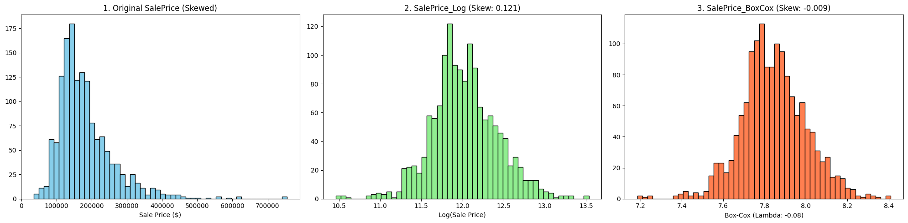

*Figure 2: Visual comparison of the three target scales: original `SalePrice` (skewed), `SalePrice_Log` (skewness 0.121), and `SalePrice_BoxCox` with $\lambda = -0.08$ (skewness $-0.009$).*

#### Interpretation of Skewness and Statistical Transformations

**Statistical rule of symmetry:**

> **The Skewness Rule:** A perfectly symmetrical distribution (a perfect bell curve) has a skewness of 0.
> - Between $-0.5$ and $0.5$: The data is considered "fairly symmetrical".
> - Greater than 1 or less than $-1$: The data is "highly skewed".

**1. Original SalePrice (Skewness: 1.883).**

- **The Deduction:** With a score of 1.883, the original data is **highly skewed**.
- **The Rule:** This exceeds the threshold of 1.0. This "positive skew" indicates a long tail to the right.
- **The Impact:** If we use this value as-is, our future models will make large errors on average-priced houses.

**2. After Log Transformation (Skewness: 0.121).**

- **The Deduction:** By applying the Log, we brought the skewness down from 1.883 to 0.121.
- **The Rule:** Since 0.121 is between $-0.5$ and $0.5$, the data is now considered **fairly symmetrical**.

**3. After Box-Cox Transformation (Skewness: $-0.009$).**

- **The Deduction:** Box-Cox is the winner with a score of $-0.009$, which is almost absolute zero.
- **The Rule of Lambda ($\lambda$):** Box-Cox Optimal Lambda ($\lambda = -0.0769$).
  - *Note:* A $\lambda$ of 0 would be a perfect Log. A $\lambda$ of $-0.0769$ means the data needed a transformation slightly "stronger" than a Log to reach near-perfect symmetry.
- **The Conclusion:** This is the most precise result possible. While the Log is "good enough," Box-Cox reaches the statistical ideal.

---

## 3 Classical Statistical Inference

The first part of the project applies basic statistical methods to explore the data: sample mean and variance of `SalePrice` and key features, confidence intervals for the mean `SalePrice`, and hypothesis testing — in particular, whether the mean differs from $180,000 and whether the distribution of the transformed `SalePrice` is normal (Shapiro–Wilk). All three target scales (`SalePrice`, `SalePrice_Log`, `SalePrice_BoxCox`) are analysed in parallel.

### 3.1 Descriptive Statistics

We compute the sample mean and variance of `SalePrice` alongside the two key features identified in the assignment:

- **`GrLivArea`:** above grade (ground) living area square feet.
- **`OverallQual`:** rates the overall material and finish of the house.

The three target scales (`SalePrice`, `SalePrice_Log`, `SalePrice_BoxCox`) are included alongside, so the descriptive statistics can be compared across transformations.

| Variable | Sample Mean | Sample Variance |
|---|---|---|
| `SalePrice` | 180921.195890 | 6.311111 × 10⁹ |
| `SalePrice_Log` | 12.024057 | 1.595597 × 10⁻¹ |
| `SalePrice_BoxCox` | 7.842249 | 2.504540 × 10⁻² |
| `GrLivArea` | 1515.463699 | 2.761296 × 10⁵ |
| `OverallQual` | 6.099315 | 1.912679 |

*Table 1: Sample mean and variance for `SalePrice`, its two transformations, and the two key features.*

**Dollar correspondence of the transformed means.** Back-converting the means of the transformed variables yields:

- **Log method mean (in dollars):** $166,716.73
- **Box-Cox method mean (in dollars):** $165,698.52

**Central tendency and dispersion.**

- **Sample Mean ($180,921.20):** this represents the standard arithmetic average of our dataset.
- **Massive Variance ($6.31 \times 10^9$):** the extreme magnitude of this variance confirms high data volatility.

**Monetary divergence (mean comparison).** After back-transforming the Log and Box-Cox means into dollar amounts, the resulting values are approximately $15,000 lower than the arithmetic mean ($180,921 vs. ~$166,000). This divergence indicates that the raw average is heavily influenced by high-value outliers (positive skew).

### 3.2 Confidence Interval

We construct a 95% confidence interval for the mean of each scale using a Student's t-distribution with $n - 1$ degrees of freedom, where $n$ is the number of observations in the training set. For the two transformed scales, the bounds of the interval are computed first on the transformed scale, then back-converted to dollars using `np.expm1` and `inv_boxcox` respectively, for direct comparison with the original interval.

| Scale | CI in dollars | CI in original scale |
|---|---|---|
| Original | $176,842.84 to $184,999.55 | 176842.84 to 184999.55 |
| Log method | $163,332.73 to $170,170.83 | 12.003551 to 12.044564 |
| Box-Cox method | $162,342.47 to $169,129.40 | 7.834125 to 7.850374 |

*Table 2: 95% confidence interval for the mean `SalePrice` on the three target scales, reported both in dollars (after back-conversion for the transformed scales) and in their original scale.*

**95% Confidence Interval (CI) Analysis.**

- **Original Interval ($176,842 to $184,999):** this range is derived from raw, skewed data, making it a less representative estimator of the market's true center.
- **Transformed Intervals (~$162,000 to ~$170,000):** both the Log and Box-Cox intervals are shifted significantly lower and do not overlap with the original interval.
- **Key Insight:** this lack of overlap proves that once the distribution is normalized (achieving symmetry), the statistical heart of the market is considerably lower than the raw data suggests.

### 3.3 Hypothesis Test

We perform six distinct tests: three one-sample t-tests against the reference value $180,000 (one per scale), and three Shapiro–Wilk normality tests (one per scale).

**One-sample t-tests against $180,000.**

- **Original `SalePrice`:** $H_0: \mu = 180{,}000$ vs. $H_1: \mu \neq 180{,}000$
- **Log transformed:** $H_0: \mu_{\log} = \log(180{,}000)$ vs. $H_1: \mu_{\log} \neq \log(180{,}000)$, with $\log(180{,}000) \approx 12.099$.
- **Box-Cox transformed:** $H_0: \mu_{\text{BoxCox}} = \text{BoxCox}(180{,}000)$ vs. $H_1: \mu_{\text{BoxCox}} \neq \text{BoxCox}(180{,}000)$

**Shapiro–Wilk normality tests.** For each of the three variables (`SalePrice`, `SalePrice_Log`, `SalePrice_BoxCox`):

- $H_0$: the distribution is normal.
- $H_1$: the distribution is not normal.

#### Raw test outputs

| Test | Reference / Observed | T-statistic | P-value |
|---|---|---|---|
| T-test (Original `SalePrice`) | ref. $180,000 / mean $180,921.20 | 0.443 | 6.578 × 10⁻¹ |
| T-test (Log transformed) | ref. 12.100718 / mean 12.024057 | −7.333 | 3.715 × 10⁻¹³ |
| T-test (Box-Cox transformed) | ref. 7.874990 / mean 7.842249 | −7.905 | 5.244 × 10⁻¹⁵ |

*Table 3: One-sample t-test outputs on the three scales.*

| Variable | Test Statistic | P-value |
|---|---|---|
| `SalePrice` | 0.870 | 3.206 × 10⁻³³ |
| `SalePrice_Log` | 0.991 | 1.149 × 10⁻⁷ |
| `SalePrice_BoxCox` | 0.992 | 1.905 × 10⁻⁷ |

*Table 4: Shapiro–Wilk normality test outputs on the three scales.*

#### Analysis of means (one-sample t-tests)

The objective was to verify whether the average price differs significantly from the $180,000 threshold. The results reveal a divergence depending on the scale used:

- **On the original scale (`SalePrice`):** the t-test compares the observed mean of $180,921.20 to the reference value of $180,000. With a p-value of 0.6578 (well above 0.05), we **fail to reject** $H_0$. There is insufficient evidence to conclude that the raw mean differs significantly from $180,000.
- **On the logarithmic scale (`SalePrice_Log`):** the situation is reversed. The test compares the observed logarithmic mean of 12.024057 to the logarithmically transformed reference value $\log(180{,}000) = 12.100712$. With an extremely low p-value of $3.729 \times 10^{-13}$, we **reject** $H_0$. There is strong evidence that the transformed mean is significantly different from (and lower than) the $\log(180{,}000)$ reference value.
- **On the Box-Cox scale (`SalePrice_BoxCox`):** the trend is confirmed. The test compares the observed Box-Cox mean of 7.842249 to the Box-Cox transformed reference value $\text{BoxCox}(180{,}000) = 7.874990$. With a p-value of $5.244 \times 10^{-15}$, we **reject** $H_0$. There is strong evidence that the Box-Cox optimized mean is significantly different from (and lower than) the $\text{BoxCox}(180{,}000)$ reference.

**Comparative interpretation.** This contradiction is explained by the nature of the original distribution. The `SalePrice` variable contains very high extreme values (right skewness) that pull the classic arithmetic mean upward, bringing it to $180,921.20 (close to the reference). The Log and Box-Cox transformations compress these extreme values. Once this effect is mitigated, the true center of the data (12.024 in Log; 7.842 in Box-Cox) reveals itself to be significantly lower than the mathematical equivalent of $180,000 (12.100 in Log; 7.874 in Box-Cox).

#### Analysis of normality (Shapiro–Wilk tests)

The objective was to determine whether the raw data or the transformations (Log and Box-Cox) followed a perfectly normal distribution.

- **On the original scale (`SalePrice`):** the test yields a test statistic of 0.870 and a p-value of $3.206 \times 10^{-33}$. We **reject** $H_0$. There is very strong evidence that the original distribution is **not normal**.
- **On the logarithmic scale (`SalePrice_Log`):** the test yields a test statistic of 0.991 and a p-value of $1.149 \times 10^{-7}$. We **reject** $H_0$. Although the statistic is much better, the logarithmic distribution is still not strictly normal.
- **On the Box-Cox scale (`SalePrice_BoxCox`):** the test yields a test statistic of 0.992 and a p-value of $1.905 \times 10^{-7}$. We **reject** $H_0$. The Box-Cox optimized distribution is also not strictly normal in the mathematical sense.

**Comparative interpretation.** Statistically, none of the three distributions is perfectly normal, as the p-values are all below 0.05 (leading to the rejection of $H_0$ each time).

#### Visualizing distributions and supporting the conclusions with plots

To support the conclusions drawn from the descriptive statistics, confidence intervals, and hypothesis tests, we produce a six-panel figure organised as three rows (one per target scale) and two columns (histogram with mean, 95% CI, and $180k target on the left; QQ-plot against the normal distribution on the right).

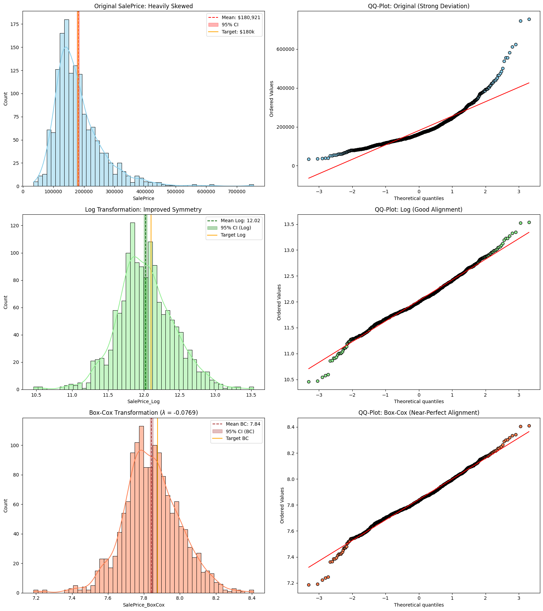

*Figure 3: Six-panel diagnostic for the three target scales. Left column: histograms with mean (dashed line), 95% confidence interval (shaded band), and the $180,000 reference (orange line). Right column: QQ-plots against the standard normal distribution. Rows: original `SalePrice` (top), `SalePrice_Log` (middle), `SalePrice_BoxCox` with $\lambda = -0.0769$ (bottom).*

**Comparative analysis of histograms.**

- **Original `SalePrice` (Blue) — Positive Skewness:** the initial distribution exhibits highly pronounced right-hand skewness. A strong concentration of transactions is observed between $100k and $200k, while a "tail" stretches out to $750k.
- **Log Transformation (Green) — Normalization via Compression:** applying the logarithm reduces variance gaps. The distribution now adopts a much more balanced bell-curve shape. The peak is better centered, and the influence of outliers at the tail of the distribution is neutralized.
- **Box-Cox Transformation (Orange) — Optimal Symmetry:** utilizing an optimized $\lambda$ ($-0.0769$), this method outperforms the logarithmic transformation by further tightening the extremes. The resulting symmetry is near-perfect.

**Comparative analysis of QQ-plots.**

- **Original (High Deviation):** a systematic deviation of the data points from the bisector (red line) is observed, particularly at the extremities. This curvature indicates that the "tails" of the actual distribution are significantly heavier than those of a normal distribution.
- **Log Transformation (Satisfactory Alignment):** the majority of observations now follow the reference line. While slight curvatures persist at the extremities (distribution tails), the overall alignment is sufficient to consider the variable as following a normal distribution for practical application.
- **Box-Cox (Near-Perfect Alignment):** the Box-Cox transformation successfully normalized the center of the data, which closely follows the red reference line. However, noticeable deviations at the extremes (downward on the left, upward on the right) show the alignment is not perfect.

---

## 4 ANOVA for Ordinal Features

The second part of the project applies ANOVA to determine which of the ten provided features have a statistically significant effect on the (transformed) `SalePrice`. The analysis is conducted on all three target scales (`SalePrice`, `SalePrice_Log`, `SalePrice_BoxCox`) in parallel.

### 4.1 Features Analyzed

Ten categorical or ordinal features are submitted to the ANOVA analysis. They are listed in the table below together with their levels and short description.

| # | Feature | Levels | Description |
|---|---|---|---|
| 1 | `OverallQual` | 1–10 | Overall material and finish quality |
| 2 | `ExterQual` | Po, Fa, TA, Gd, Ex | Exterior material quality |
| 3 | `BsmtQual` | None, Po, Fa, TA, Gd, Ex | Basement height quality |
| 4 | `KitchenQual` | Po, Fa, TA, Gd, Ex | Kitchen quality |
| 5 | `FireplaceQu` | None, Po, Fa, TA, Gd, Ex | Fireplace quality |
| 6 | `CentralAir` | N, Y | Central air conditioning |
| 7 | `LotShape` | IR3, IR2, IR1, Reg | General shape of property |
| 8 | `LandSlope` | Sev, Mod, Gtl | Slope of property |
| 9 | `MoSold` | 1–12 | Month sold |
| 10 | `YrSold` | 2006–2010 | Year sold |

*Table 5: The ten features submitted to ANOVA analysis, with their levels and description.*

### 4.2 One-Way ANOVA

#### Our approach

1. **Data inspection (categories):** we first look at the unique categories (levels) for each of our 10 features (e.g., checking that missing basements have been correctly grouped into a `None` category).
2. **One-Way ANOVA:** we run the ANOVA test for each feature against our standard target (`SalePrice`) as well as our two normalized targets (`SalePrice_Log` and `SalePrice_BoxCox`). This allows us to determine which features significantly influence the price and to observe how mathematical transformations affect the statistical significance.

#### Results: identifying significant features (p < 0.05)

The table below reports the F-statistic, p-value, and significance verdict for each of the ten features across the three target scales. If $p < 0.05$, the feature is considered a significant driver of price.

| Feature | F (Orig.) | p (Orig.) | Sig. | F (Log) | p (Log) | Sig. | F (BC) | p (BC) | Sig. |
|---|---|---|---|---|---|---|---|---|---|
| `OverallQual` | 349.02 | 0.00e+00 | YES | 332.16 | 0.00e+00 | YES | 325.93 | 0.00e+00 | YES |
| `ExterQual` | 443.33 | 1.43e-204 | YES | 415.30 | 6.93e-195 | YES | 406.19 | 1.12e-191 | YES |
| `BsmtQual` | 316.14 | 8.15e-196 | YES | 300.39 | 2.02e-188 | YES | 294.55 | 1.23e-185 | YES |
| `KitchenQual` | 407.80 | 3.03e-192 | YES | 393.32 | 4.43e-187 | YES | 386.07 | 1.83e-184 | YES |
| `FireplaceQu` | 121.07 | 2.97e-107 | YES | 131.19 | 6.96e-115 | YES | 130.06 | 4.88e-114 | YES |
| `CentralAir` | 98.30 | 1.80e-22 | YES | 205.66 | 9.85e-44 | YES | 215.98 | 1.06e-45 | YES |
| `LotShape` | 40.13 | 6.44e-25 | YES | 46.72 | 7.85e-29 | YES | 46.63 | 8.89e-29 | YES |
| `LandSlope` | 1.95 | 0.141 | NO | 1.08 | 0.338 | NO | 0.98 | 0.373 | NO |
| `MoSold` | 0.95 | 0.483 | NO | 0.99 | 0.449 | NO | 1.00 | 0.443 | NO |
| `YrSold` | 0.64 | 0.630 | NO | 0.73 | 0.565 | NO | 0.75 | 0.555 | NO |

*Table 6: One-Way ANOVA results for the ten features on the three target scales. Significance is declared at $\alpha = 0.05$.*

#### Summary of significant features

The most striking takeaway from the table is that **transforming the target variable did not change the final "True/False" significance verdict for a single feature.** Seven features emerge as significant across all three scales:

> `OverallQual`, `ExterQual`, `BsmtQual`, `KitchenQual`, `FireplaceQu`, `CentralAir`, `LotShape`.

### 4.3 Two-Way ANOVA and Interactions

#### Objective

Test whether **two features have a joint effect (interaction) on the sale price.** For example: does the effect of kitchen quality on price also depend on the overall quality of the house?

- **No interaction:** central air conditioning adds $10,000 to the price, regardless of whether the house is low-quality or high-quality.
- **Interaction:** central air conditioning adds only $2,000 to a low-quality house but $30,000 to a high-quality house.

In the second case the two features "interact" because the benefit of one depends on the level of the other. Operationally, the interaction is read from the p-value attached to the term `C(f1):C(f2)` in a Type II ANOVA table: $p < 0.05$ means the two features influence the price jointly, $p \geq 0.05$ means they act independently. Up to Section 4.2 we already knew, from One-Way ANOVA, that each of the seven significant features individually has a significant effect on price. The entire detour described below is not aimed at re-confirming those main effects — it is aimed at unlocking a quantity that One-Way ANOVA cannot measure: **the interaction term.**

#### Why OLS with Type II Sum of Squares

Two-Way ANOVA can be computed either via the classical manual Sum-of-Squares formulas or via an OLS regression. We choose OLS for two concrete reasons.

**1. Our design is unbalanced.** The classical Two-Way ANOVA formula was designed for **balanced designs** — where every combination of two features contains exactly the same number of observations. In our dataset, group sizes are highly unequal (e.g., `OverallQual` level 5 contains hundreds of houses, level 1 contains only 2). The OLS approach combined with Type II Sum of Squares (`anova_lm(model, typ=2)`) handles this: it tests each effect after accounting for all other effects simultaneously, producing unambiguous results regardless of group sizes.

**2. The interaction term is natural in a regression formula.** The classical computation of the interaction Sum of Squares is a cascading subtraction

$$SS_{\text{interaction}} = SS_{\text{total}} - SS_A - SS_B - SS_{\text{error}}$$

which amplifies rounding errors and becomes complex when categories have many levels. With OLS, the interaction is directly encoded in the model formula:

$$Y \sim C(A) + C(B) + C(A):C(B)$$

The term `C(A):C(B)` creates dummy variables for every combination of A and B, and the corresponding p-value is read directly from the ANOVA table.

#### First attempt: 100% of pairs are blocked

We applied the Two-Way ANOVA pipeline to all $\binom{7}{2} = 21$ pairs of significant features identified in Section 4.2. Before fitting any model, the code performs a completeness check on the crosstab of each pair: any cell with $N = 0$ (empty combination) or $N = 1$ (singleton — no within-cell variance) blocks the analysis. The mechanism behind these blockages is mathematical:

- **Empty cells ($N = 0$):** computing the cell mean requires dividing by zero observations, which is undefined. The design matrix becomes singular and the OLS solver cannot invert it.
- **Singletons ($N = 1$):** the cell mean exists, but the within-cell variance formula divides by $N - 1 = 0$. The F-statistic for the interaction term requires this variance, so the test becomes undefined.

We cannot work around these failures by zero-filling (which would inject a fake interaction) or by leaving the cells NaN (which would make the matrix singular).

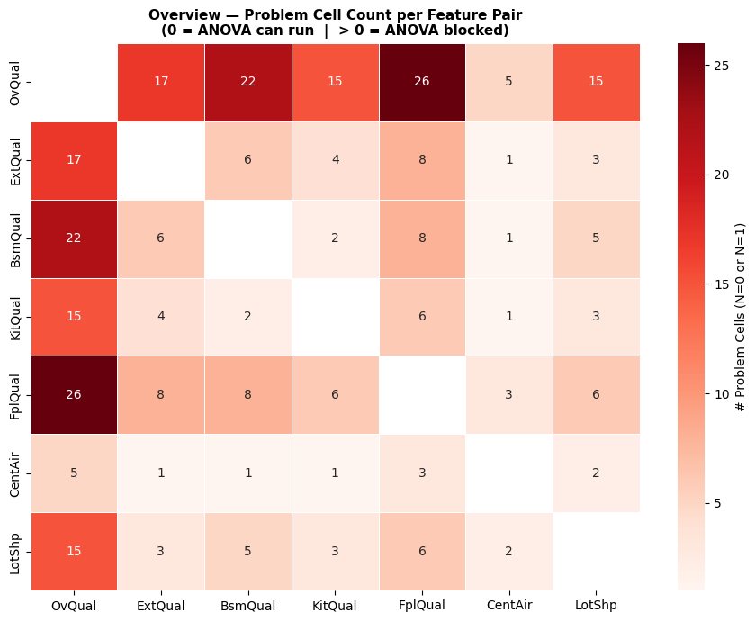

*Figure 4: Overview heatmap of problem cells per feature pair. Each off-diagonal cell counts the total $N=0$ plus $N=1$ combinations between the two corresponding features. Every pair shows a positive count, confirming that 100% of the 21 pairs are blocked.*

Five representative crosstabs (`OverallQual × ExterQual`, `OverallQual × BsmtQual`, `OverallQual × CentralAir`, `ExterQual × KitchenQual`, `CentralAir × LotShape`) are shown in Figures 5–9, with blue cells indicating safe combinations ($N \geq 2$), black cells indicating holes ($N = 0$), and red cells indicating fragile singletons ($N = 1$).

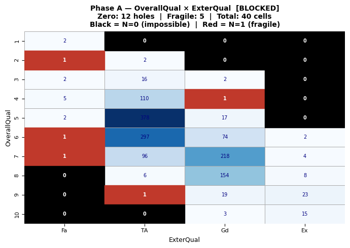

*Figure 5: Crosstab OverallQual × ExterQual. Blue cells: safe ($N \geq 2$); black cells with "0": empty combinations; red cells with "1": fragile singletons. Pair flagged as [BLOCKED].*

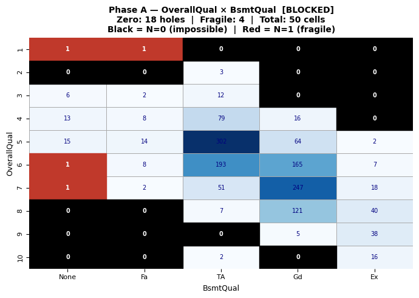

*Figure 6: Crosstab OverallQual × BsmtQual. Same colour code as above. Pair flagged as [BLOCKED].*

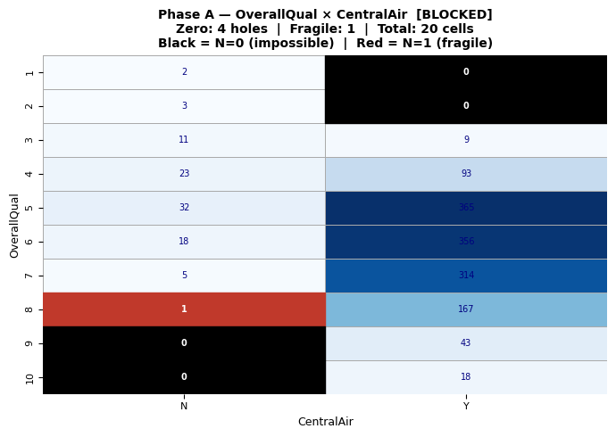

*Figure 7: Crosstab OverallQual × CentralAir. Same colour code as above. Pair flagged as [BLOCKED].*

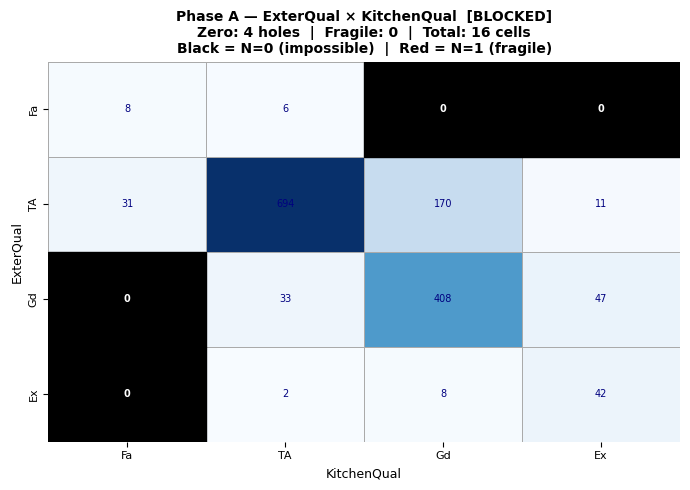

*Figure 8: Crosstab ExterQual × KitchenQual. Same colour code as above. Pair flagged as [BLOCKED].*

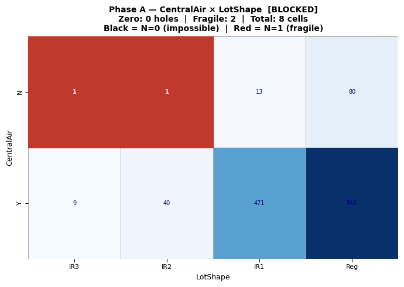

*Figure 9: Crosstab CentralAir × LotShape. Same colour code as above. Pair flagged as [BLOCKED].*

The full severity ranking of the 21 pairs is given in the table below.

| # | Pair | Total Cells | Holes (N=0) | Fragile (N=1) | Problems | Status |
|---|---|---|---|---|---|---|
| 0 | `OverallQual × FireplaceQu` | 60 | 22 | 4 | 26 | [BLOCKED] |
| 1 | `OverallQual × BsmtQual` | 50 | 18 | 4 | 22 | [BLOCKED] |
| 2 | `OverallQual × ExterQual` | 40 | 12 | 5 | 17 | [BLOCKED] |
| 3 | `OverallQual × KitchenQual` | 40 | 12 | 3 | 15 | [BLOCKED] |
| 4 | `OverallQual × LotShape` | 40 | 10 | 5 | 15 | [BLOCKED] |
| 5 | `BsmtQual × FireplaceQu` | 30 | 6 | 2 | 8 | [BLOCKED] |
| 6 | `ExterQual × FireplaceQu` | 24 | 6 | 2 | 8 | [BLOCKED] |
| 7 | `FireplaceQu × LotShape` | 24 | 3 | 3 | 6 | [BLOCKED] |
| 8 | `ExterQual × BsmtQual` | 20 | 3 | 3 | 6 | [BLOCKED] |
| 9 | `KitchenQual × FireplaceQu` | 24 | 5 | 1 | 6 | [BLOCKED] |
| 10 | `OverallQual × CentralAir` | 20 | 4 | 1 | 5 | [BLOCKED] |
| 11 | `BsmtQual × LotShape` | 20 | 3 | 2 | 5 | [BLOCKED] |
| 12 | `ExterQual × KitchenQual` | 16 | 4 | 0 | 4 | [BLOCKED] |
| 13 | `FireplaceQu × CentralAir` | 12 | 2 | 1 | 3 | [BLOCKED] |
| 14 | `KitchenQual × LotShape` | 16 | 2 | 1 | 3 | [BLOCKED] |
| 15 | `ExterQual × LotShape` | 16 | 1 | 2 | 3 | [BLOCKED] |
| 16 | `BsmtQual × KitchenQual` | 20 | 2 | 0 | 2 | [BLOCKED] |
| 17 | `CentralAir × LotShape` | 8 | 0 | 2 | 2 | [BLOCKED] |
| 18 | `ExterQual × CentralAir` | 8 | 1 | 0 | 1 | [BLOCKED] |
| 19 | `KitchenQual × CentralAir` | 8 | 0 | 1 | 1 | [BLOCKED] |
| 20 | `BsmtQual × CentralAir` | 10 | 1 | 0 | 1 | [BLOCKED] |

*Table 7: Severity summary of the 21 feature pairs, sorted by total number of problem cells. The full grid is blocked: even the least severe pairs at the bottom contain at least one problem cell, which is enough to block the test.*

The root cause is **structural rather than methodological.** The dataset is **observational**: certain quality combinations simply do not exist in the housing market (a house with overall quality "Very Poor" and an "Excellent" fireplace, for example). Classical Two-Way ANOVA was designed for controlled experimental designs where all combinations are guaranteed by construction; observational data does not satisfy this prerequisite.

#### Two naive approaches and why they fail

Before designing the pipeline, we considered two simpler strategies and rejected both.

**Approach 1 — Dropping rare sub-categories.** The idea is to remove the levels that create empty cells (e.g., drop `Po` and `Fa` from `FireplaceQu` because too few houses fall into those categories). This causes real information loss and biases the results: dropping "Poor" and "Fair" means analysing only average-to-excellent quality houses, so the model no longer represents the full market. Conclusions would be valid only on a subset of the data, making them non-generalisable.

**Approach 2 — Naive merging (the small-sample trap).** The idea is to merge rare levels with their neighbours to fill the empty cells, based purely on a t-test of mean equality. This falls into a subtle but systematic trap.

Consider `FireplaceQu` on `SalePrice_Log`: "Po" has $N = 3$, mean = 11.80, $\sigma = 0.41$; "Fa" has $N = 28$, mean = 11.85, $\sigma = 0.38$. The gap between means is only 0.05, the t-test returns $p = 0.72$, and a naive reading would conclude "compatible, safe to merge". But the 95% confidence interval on the true mean of "Po" is

$$11.80 \pm 2.92 \times \frac{0.41}{\sqrt{3}} = [11.11, 12.49],$$

so the true mean of "Poor" could plausibly be as high as 12.3 — a real gap of $+0.45$ against "Fair", equivalent to a ~45% price difference. The t-test fails to detect this gap not because it does not exist, but because $N = 3$ gives the test no statistical power. The problem is systematic in our dataset: the rare sub-categories (the ones causing empty cells) are exactly those with low $N$. The merging approach therefore falls into a vicious cycle — the categories that need merging are precisely those for which merging is statistically unreliable.

We need a strategy that (i) merges only when the indistinguishability is detected with appropriate multiple-testing protection, and (ii) refuses to merge when doing so would violate the ordinal or categorical structure of the variable. This motivates the 4-cell pipeline below.

#### The escape route: a 4-cell pipeline

Rather than abandon the Two-Way ANOVA, we implement an **intelligent binning strategy**: merge ordinally adjacent levels that the data cannot distinguish, in order to refill the empty cells. The pipeline runs in four cells:

1. **Cell A — Tukey HSD:** map every pairwise within-feature difference and flag which level pairs are statistically indistinguishable.
2. **Cell B — Rule-based filter:** keep only the merge candidates that are both non-significant in Tukey and structurally meaningful (no fusing of non-adjacent levels, no fusing of a binary variable, no fusing across nominal macro-families).
3. **Cell C — Union-Find fusion + diagnostic:** apply the filtered candidates as a transitive equivalence relation on the levels of each feature, then recompute the crosstabs to see which pairs are now unblocked.
4. **Cell D — Two-Way ANOVA:** run the OLS test on the pairs that survived, skip the rest with an explicit reason.

The pipeline is repeated independently on the three target scales (`SalePrice`, `SalePrice_Log`, `SalePrice_BoxCox`), since the choice of scale affects which levels Tukey considers indistinguishable and therefore which fusions are produced.

**Cell A — Tukey HSD.** Tukey's Honestly Significant Difference test compares the means of every pair of levels within a feature (e.g. all 45 pairs for the 10 levels of `OverallQual`), and returns a family-wise-corrected p-value for each comparison. The correction matters: running many comparisons at once inflates the false-positive rate; Tukey controls the family-wise error rate, so the verdict on each pair stays reliable even when dozens of tests are run together. This is precisely the protection that the naive t-test in Approach 2 lacks.

For each pair we obtain a `meandiff` (gap between the two group means), a `p-adj` (family-wise-corrected p-value), and a `reject` verdict ($H_0$ rejected or not). A non-significant pair ($p \geq 0.05$) is a candidate for merging; a significant pair must never be merged.

Because the same statistical information is read on three scales with very different units, we format `meandiff` differently per target to keep the output legible: dollars for `SalePrice`; log units with a percentage equivalent $e^\Delta - 1$ for `SalePrice_Log`; raw value to six decimals for `SalePrice_BoxCox` (the Box-Cox scale has no intuitive interpretation since $\lambda \approx -0.0769$). The table below consolidates the pair counts across the three target scales.

| Feature | Total Pairs | Sig. (Orig.) | Non-Sig. (Orig.) | Sig. (Log) | Non-Sig. (Log) | Sig. (BC) | Non-Sig. (BC) |
|---|---|---|---|---|---|---|---|
| `OverallQual` | 45 | 37 | 8 | 43 | 2 | 43 | 2 |
| `ExterQual` | 6 | 6 | 0 | 6 | 0 | 6 | 0 |
| `BsmtQual` | 10 | 8 | 2 | 9 | 1 | 9 | 1 |
| `KitchenQual` | 6 | 6 | 0 | 6 | 0 | 6 | 0 |
| `FireplaceQu` | 15 | 12 | 3 | 13 | 2 | 13 | 2 |
| `CentralAir` | 1 | 1 | 0 | 1 | 0 | 1 | 0 |
| `LotShape` | 6 | 3 | 3 | 2 | 4 | 2 | 4 |
| **TOTAL** | **89** | **73** | **16** | **80** | **9** | **80** | **9** |

*Table 8: Tukey HSD pair counts per feature on the three target scales. "Non-Sig." counts the raw merge candidates before structural filtering.*

Two observations stand out. First, **transforming the target dramatically reduces the number of non-significant pairs** — from 16 on the original scale down to 9 on both Log and Box-Cox. The mechanism is the heavy variance within high-quality groups on the original scale (a single $750k outlier in the `OverallQual = 9` group inflates the standard error), which Tukey's test compares against the gap between means; once the scale is normalised the variance shrinks and previously hidden differences become detectable. Second, Log and Box-Cox produce nearly identical verdicts on every feature, consistent with the fact that the optimal Box-Cox parameter ($\lambda \approx -0.0769$) is close to 0 — the value at which Box-Cox becomes a logarithm.

**Cell B — Rule-based filter.** Tukey alone tells us which means are statistically indistinguishable, but it does not tell us whether merging them is structurally meaningful. Blindly merging on p-values alone leads to two failure modes: destroying ordinal structure (merging "Poor" with "Excellent" just because their sample means happened to be close) and collapsing categorical semantics. We therefore enforce three rules in addition to the Tukey verdict.

- **Rule 1 — Ordinal Proximity (for ordinal features).** For features with a natural ordering (`OverallQual` 1→10, `ExterQual`/`KitchenQual` Po→Ex, `BsmtQual`/`FireplaceQu` None→Ex), only **adjacent pairs** on the scale are eligible. Merging `Po` with `Fa` is acceptable (direct neighbours on a quality ladder); merging `Po` with `Ex` is forbidden, because it would create a group spanning the entire quality range with no real-world meaning. This rule preserves the monotonic relationship between quality level and price that justified treating these features as ordinal in the first place.
- **Rule 2 — Binary Lock (for binary features).** The variable `CentralAir` has only two levels (N, Y). Merging them would eliminate the variable entirely: a feature with a single level carries zero information. Even if Tukey returned a non-significant verdict, fusion would be analytically nonsensical. `CentralAir` is therefore marked as **untouchable**: no pair is eligible.
- **Rule 3 — Nominal Macro-Families (for nominal features).** `LotShape` is the only non-ordinal feature in the set. Its four levels (Reg, IR1, IR2, IR3) split naturally into two semantic families: **Reg** (regular rectangular lot) versus **IR1/IR2/IR3** (progressively more irregular shapes). Eligible pairs are restricted to those within the same macro-family — any pair among {IR1, IR2, IR3} is allowed, but no irregular level may ever be merged with `Reg`.
- **Rule 4 — Handling `None` (automatic).** Some features (`BsmtQual`, `FireplaceQu`) include a `None` level representing the absence of the feature. We place `None` at the bottom of the ordinal scale, so Rule 1 automatically applies: `None` is adjacent only to the lowest quality level (`Po`).

A pair becomes a merge candidate if and only if it satisfies both eligibility (R1, R2, or R3) and non-significance in Tukey. The table below shows the final candidate counts after applying the filter.

| Feature | SalePrice | SalePrice_Log | SalePrice_BoxCox |
|---|---|---|---|
| `OverallQual` | 3 | 2 | 2 |
| `ExterQual` | 0 | 0 | 0 |
| `BsmtQual` | 2 | 1 | 1 |
| `KitchenQual` | 0 | 0 | 0 |
| `FireplaceQu` | 2 | 2 | 2 |
| `CentralAir` | 0 | 0 | 0 |
| `LotShape` | 2 | 3 | 3 |
| **TOTAL** | **9** | **8** | **8** |

*Table 9: Final merge candidates per feature and target, after applying the three structural rules. Three features (`ExterQual`, `KitchenQual`, `CentralAir`) produce zero candidates on all three targets and will pass through to the fusion step unchanged.*

The structural filter has the biggest effect on the original scale: of the 16 raw non-significant pairs returned by Tukey, only 9 survive. The cuts come almost entirely from `OverallQual` — pairs like (1, 3), (1, 4), (1, 5), (2, 4), (2, 5) are non-adjacent and are blocked by Rule 1. On the transformed scales, almost no candidate is wasted (8 of 9 raw candidates survive), which is consistent with the fact that the transformations naturally yield Tukey-non-significant pairs at the extremes of each scale (e.g. adjacent pairs like (1, 2) and (9, 10) on `OverallQual`).

**Cell C — Union-Find fusion and post-merge diagnostic.** The merge candidates returned by Cell B are individual pairs, but they chain together. For example, on `SalePrice`, the candidates for `OverallQual` include (1, 2), (2, 3), (3, 4). Taken pair by pair these describe local indistinguishability; together they form a **transitive equivalence relation** that groups the four levels into a single class $\{1, 2, 3, 4\}$. We need an algorithm that respects this transitivity rather than producing three disjoint pairings, which would be analytically incoherent.

We use the standard **Union-Find algorithm**:

- Initialise a `parent` mapping where every level points to itself.
- For every candidate pair $(a, b)$, call `union(a, b)` to link the two groups containing $a$ and $b$.
- After processing all candidates, the connected components of the graph define the merged classes. Each class is labelled with a canonical name built by joining its members in ordinal order (e.g. `1+2+3+4`, `Fa+None`, `IR1+IR2+IR3`).

**Fusion is a hopeful operation, not a guaranteed one.** Two structural reasons explain why the Two-Way ANOVA can remain blocked even after merging. First, no candidates means no fusion: three of the seven features (`ExterQual`, `KitchenQual`, `CentralAir`) produced zero merge candidates on all three targets, so their level structure stays exactly as it was, and any feature pair involving one of them inherits the same empty cells as before. Second, even where candidates exist, they only collapse levels that Tukey **failed** to distinguish; if a feature has empty cells caused by levels that Tukey did distinguish (which we are forbidden from merging), those cells persist. The post-fusion diagnostic is therefore not a formality — it is the only way to know, pair by pair, where the Two-Way ANOVA in Cell D becomes runnable.

The table below shows the equivalence classes produced for each feature on each target.

| Feature | SalePrice | SalePrice_Log | SalePrice_BoxCox |
|---|---|---|---|
| `OverallQual` | [1+2+3+4] | [1+2], [9+10] | [1+2], [9+10] |
| `ExterQual` | — (no change) | — (no change) | — (no change) |
| `BsmtQual` | [None+Fa+TA] | [None+Fa] | [None+Fa] |
| `KitchenQual` | — (no change) | — (no change) | — (no change) |
| `FireplaceQu` | [None+Po+Fa] | [None+Po], [TA+Gd] | [None+Po], [TA+Gd] |
| `CentralAir` | — (locked by R2) | — (locked by R2) | — (locked by R2) |
| `LotShape` | [IR3+IR2+IR1] | [IR3+IR2+IR1] | [IR3+IR2+IR1] |

*Table 10: Applied fusions per feature and target, after Union-Find. The original scale produces aggressive 3- and 4-level chains on `OverallQual`, `BsmtQual`, and `FireplaceQu`; the transformed scales produce more cautious 2-level fusions at the extremes.*

After fusion, we re-compute the 21 crosstabs on each target to count residual empty cells and singletons.

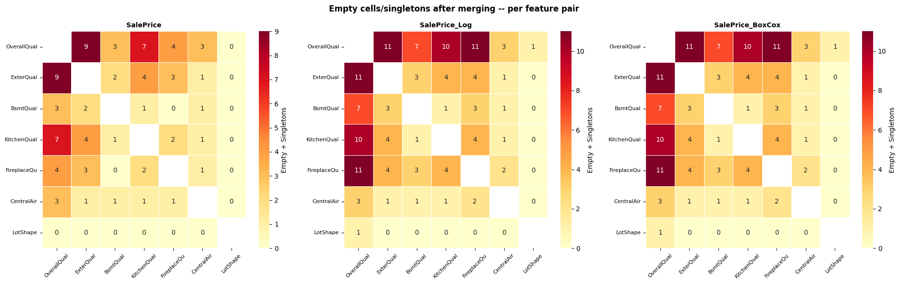

*Figure 10: Empty cells plus singletons after merging, per feature pair, on the three target scales. A value of 0 means the pair is now unblocked and can be tested via Two-Way ANOVA. On `SalePrice`, the `LotShape` row and column are entirely zero. On `SalePrice_Log` and `SalePrice_BoxCox`, the `LotShape` row and column are also nearly zero (a single residual singleton on `OverallQual × LotShape`). The `OverallQual` row remains the most saturated on the transformed scales.*

The fusion strategy partially succeeded: `LotShape`-anchored pairs are fully unblocked on every target (consequence of the aggressive 3-level fusion `[IR3+IR2+IR1]`), and a few additional pairs are unblocked on the original scale thanks to the 4-level fusion `[1+2+3+4]` on `OverallQual`. The original scale ends up with **7 testable pairs out of 21**; the Log and Box-Cox scales end up with **5 each**, leaving 38 and 73 residual problem cells respectively.

**A counter-intuitive result: the original scale outperforms the transformed scales at this step.** The transformed scales have been consistently better than the original throughout the Tukey analysis (more pairs detected as significant, cleaner separability). Yet here the original ends up with roughly half the residual problem cells. The mechanism is structural, not statistical. The original scale produced an aggressive 4-level fusion on `OverallQual` (`[1+2+3+4]`), while Log/BoxCox produced two cautious 2-level fusions (`[1+2]` and `[9+10]`). This difference comes from how Tukey behaved on each scale: on the original, the test failed to separate 8 low-end pairs because the variance was inflated by outliers, so many of them survived the structural filter as candidates. On Log/BoxCox, the compressed variance restored separability across the middle of the scale, leaving only the extremes as non-significant. Tukey was therefore "more correct" on the transformed scales — but its correctness translated into fewer fusions, which means more surviving levels, which means more crosstab cells, which means more opportunities for emptiness. Two-Way ANOVA needs **density**, not **discrimination**; the original scale's over-merging is a statistical compromise that pays off in operational feasibility.

**Cell D — Two-Way ANOVA on the unblocked pairs.** For each pair that survived the diagnostic, we fit the OLS model

$$\text{target} \sim C(f_1) + C(f_2) + C(f_1):C(f_2)$$

on the fused dataframe, and read the interaction p-value from row `C(f1):C(f2)` of the Type II ANOVA table. Pairs that did not survive are skipped with an explicit reason (`SKIP (n empty cell(s))` or `SKIP (n singleton(s))`). The two skip conditions are reported separately so the failure mode is diagnosable: empty cells make the design matrix singular, while singletons make the within-cell variance undefined. Significance is coded with the conventional stars: `***` for $p < 0.001$, `**` for $p < 0.01$, `*` for $p < 0.05$, `.` for $p < 0.10$.

#### Results

The table below gives the overall counts of tested pairs and significant interactions on each scale.

| Target | Tested / Total | Skipped | Sig. (p < 0.05) | Borderline (0.05 ≤ p < 0.10) |
|---|---|---|---|---|
| `SalePrice` | 7 / 21 | 14 | 3 | 1 |
| `SalePrice_Log` | 5 / 21 | 16 | 3 | 0 |
| `SalePrice_BoxCox` | 5 / 21 | 16 | 3 | 0 |

*Table 11: Two-Way ANOVA outcome per target. Each scale yields exactly 3 significant interactions. Main effects (`C(f1)` and `C(f2)`) were massively significant ($p < 0.001$) on every tested pair, re-confirming the One-Way ANOVA verdicts of Section 4.2.*

The table below consolidates every interaction found significant on at least one target.

| Pair | SalePrice | SalePrice_Log | SalePrice_BoxCox |
|---|---|---|---|
| `OverallQual × LotShape` | F = 3.21, p = 0.0039 ** | SKIP (singleton) | SKIP (singleton) |
| `ExterQual × LotShape` | F = 2.92, p = 0.0332 * | F = 4.20, p = 0.0057 ** | F = 4.30, p = 0.0050 ** |
| `BsmtQual × FireplaceQu` | F = 8.52, p < 0.0001 *** | SKIP (empty) | SKIP (empty) |
| `BsmtQual × LotShape` | F = 0.24, p = 0.7879 | F = 3.28, p = 0.0202 * | F = 3.43, p = 0.0165 * |
| `KitchenQual × LotShape` | F = 2.00, p = 0.1117 | F = 4.79, p = 0.0025 ** | F = 5.07, p = 0.0017 ** |
| `FireplaceQu × LotShape` | F = 2.13, p = 0.0945 . | F = 0.62, p = 0.6029 | F = 0.57, p = 0.6356 |
| `CentralAir × LotShape` | F = 0.49, p = 0.4824 | F = 0.30, p = 0.5833 | F = 0.28, p = 0.5969 |

*Table 12: All Two-Way ANOVA verdicts on tested pairs. Only `ExterQual × LotShape` is significant on all three targets simultaneously.*

Three patterns emerge across the cross-target comparison.

**`LotShape` is the structural hub of every detected interaction.** Out of the 9 significant-interaction verdicts across the three targets, 8 involve `LotShape` (the exception is `BsmtQual × FireplaceQu` on the original scale). This is the direct mechanical consequence of Cell C: `LotShape` was the only feature where the fusion strategy fully unlocked the matrix (collapse of the irregular family), so every pair involving `LotShape` becomes testable. The analysis therefore tells us about interactions with lot shape specifically, not about interactions in general — the structural limitation of the data filters the type of insight we can extract.

**The original scale unlocks a unique interaction: `BsmtQual × FireplaceQu`.** This pair is the strongest interaction detected in the entire analysis ($F = 8.52$, $p < 0.0001$), but it appears only on the original scale. The reason is again structural: on the original scale, the aggressive 3-level fusions `[None+Fa+TA]` on `BsmtQual` and `[None+Po+Fa]` on `FireplaceQu` shrank the crosstab enough to fully resolve it; on Log and Box-Cox, the cautious 2-level merges left this crosstab still fragmented. This is a concrete case where the original scale provides analytical access that the transformed scales lose. The interaction is real and economically interpretable: the joint presence or absence of a quality basement and a quality fireplace creates a price premium beyond their additive contributions.

**Log/BoxCox reveal interactions hidden by original-scale variance.** Two pairs — `BsmtQual × LotShape` and `KitchenQual × LotShape` — are clearly non-significant on the original scale ($p = 0.79$ and $p = 0.11$) but clearly significant on Log and Box-Cox. The mechanism is the same as in the Tukey step: the heavy-tailed original scale inflates within-cell variance, drowning the interaction signal under noise; once the scale is normalised, the variance shrinks and the interaction emerges. The choice of scale therefore changes not only which pairs are testable but also which signals are visible.

#### Operational verdict

The Two-Way ANOVA pipeline produced the following:

- **Robust interaction confirmed on all three targets:** `ExterQual × LotShape` — the most reliable joint effect, detected regardless of scale.
- **Strong interaction confirmed only on the original scale:** `BsmtQual × FireplaceQu` (the largest F-value of the analysis, but untestable on Log/BoxCox due to residual empty cells).
- **Interactions confirmed on the transformed scales:** `BsmtQual × LotShape`, `KitchenQual × LotShape`, and `OverallQual × LotShape` (this last one tested only on the original scale due to a residual singleton on Log/BoxCox).
- **Interactions explicitly rejected:** `FireplaceQu × LotShape` (borderline on the original scale, clearly non-significant on the transformed scales) and `CentralAir × LotShape` (non-significant on all three targets).
- **Main effects:** massively significant ($p < 0.001$) on every tested pair, re-confirming the One-Way ANOVA verdicts of Section 4.2.
- **Unresolved pairs:** 14 on the original scale, 16 on the transformed scales — documented as a structural limitation of the observational nature of the dataset.

The fusion strategy converted a 0%-feasible situation into a 24%–33%-feasible one. The interactions we can assert with confidence will inform the modelling choices in Sections 5 (factorial design) and 6 (regression), and Section 7 (neural network) can rely on them as a structural prior on the housing market. The interactions we cannot test remain documented as a limitation rooted in the observational nature of the data — no amount of statistically justified merging can manufacture combinations the housing market never produced.

---

## 5 2^k Factorial Design

Section 4 established **which features matter** (One-Way ANOVA) and **which pairs interact** when the matrix is dense enough (Two-Way ANOVA on a filtered subset). This section takes a different angle: instead of testing features one or two at a time, we build a **$2^k$ factorial design** where $k$ chosen factors are studied **simultaneously**, each reduced to two levels (Low / High). With $k$ factors and 2 levels each, we obtain $2^k$ treatment combinations, every one of which is analysed under the same structural footing.

This design unlocks three quantities at once:

- the **main effect** of each factor (how the price shifts when this factor moves from Low to High, averaged over the others);
- the **two-way interactions** for every pair of factors (whether the effect of one depends on the level of the other);
- the **higher-order interaction** (whether the two-way interactions themselves vary with the third factor — the three-way interaction in our case).

Compared to the Two-Way ANOVA of Section 4.3, the factorial framework is more compact (every effect is read as a contrast between group means) and avoids the blocking problem we faced there, because the factors are binarised — far fewer combinations exist, so the matrix is naturally dense.

### 5.1 Factor Selection and Binarization

#### Why k = 3

The choice of $k$ is a trade-off between analytical richness and interpretability:

- $k = 2$ → only 4 combinations, only one possible interaction (AB). Too thin to learn anything beyond what Two-Way ANOVA already gave us.
- $k = 3$ → 8 combinations, three two-way interactions (AB, AC, BC), and one three-way interaction (ABC). Rich enough to expose joint-effect structure, compact enough to plot and read.
- $k = 4$ → 16 combinations and 11 distinct effect terms. The effect estimates become hard to compare visually, and interaction plots multiply.

We choose $k = 3$ as the sweet spot.

#### Which three features

The 7 features confirmed significant in Section 4.2 are all eligible. To keep the design clean and informative, we pick the three that satisfy two criteria simultaneously: **strongest main effects** in One-Way ANOVA (so the factors already carry weight individually) and **natural or near-natural binary split** (so the binarisation step is as lossless as possible). This narrows the choice to:

- **Factor A — `OverallQual`** ($F \approx 349$). The strongest ordinal driver of price.
- **Factor B — `KitchenQual`** ($F \approx 408$, the largest F-statistic of Section 4.2). The strongest categorical driver of price.
- **Factor C — `CentralAir`** (already binary in the raw data — N / Y). Zero information loss in the binarisation step, which makes it the ideal third factor regardless of its rank.

The remaining significant features (`ExterQual`, `BsmtQual`, `FireplaceQu`, `LotShape`) are set aside for this design.

#### Binarisation thresholds

- **Factor A — `OverallQual` ≥ 7.** The variable is a 1–10 scale with dataset median ≈ 6. The threshold is placed just above the median to clearly isolate above-average-quality houses from the rest. $A = 1$ if `OverallQual` ≥ 7, else $A = 0$.
- **Factor B — `KitchenQual` ∈ {Gd, Ex}.** The variable has 5 ordered levels (Po < Fa < TA < Gd < Ex), mapped to integers 1–5 via `kit_order`. We cut at integer level ≥ 4: the two top tiers form the High group, the three bottom tiers form the Low group.
- **Factor C — `CentralAir` = Y.** Already binary. $C = 1$ if `CentralAir == 'Y'`, else $C = 0$.

#### Balance check

Before computing any cell mean, we verify that no factor is so unbalanced that an arm of the $2^3$ design risks being empty. The table below shows the Low/High distribution per factor.

| Factor | Description | Low (0) | High (1) |
|---|---|---|---|
| A — `OverallQual` | threshold ≥ 7 | 912 (62.5%) | 548 (37.5%) |
| B — `KitchenQual` | Gd / Ex | 774 (53.0%) | 686 (47.0%) |
| C — `CentralAir` | Y = Yes | 95 (6.5%) | 1365 (93.5%) |

*Table 13: Distribution of the three binarised factors.*

- **Factor A (62.5% / 37.5%).** The threshold at ≥ 7 isolates roughly one third of the dataset as above-average-quality houses. The split is uneven but not problematic — both arms contain hundreds of observations (912 and 548), more than enough to estimate group means with stable precision.
- **Factor B (53.0% / 47.0%).** The cut produces a near-perfectly balanced split. This is the cleanest of the three factors: the two arms have almost the same size, so contrasts involving B will be statistically efficient.
- **Factor C (6.5% / 93.5%).** The split is highly asymmetric — only 95 houses out of 1460 lack central air conditioning. This reflects the structural reality of the housing market (central air is the norm, not the exception), but it has direct consequences for the $2^3$ design: when this small `C=No` subset is cross-filtered by A and B, several cells will collapse to very small sample sizes, as we will see in Section 5.2.

### 5.2 Main Effects and Interactions

#### Methodological choice: direct contrasts versus regression

A $2^k$ factorial design can be analysed in two equivalent ways:

- **Direct contrasts (classical DoE approach):** compute the mean of each treatment combination, then build effect estimates as linear combinations of these cell means (e.g. the main effect of A is the average of the four "A high" cell means minus the average of the four "A low" cell means).
- **Regression approach:** fit a fully crossed OLS model `Y ~ A * B * C` and read the effects from the coefficients.

The two methods are **mathematically equivalent** on a balanced design and produce the same numerical answers. We adopt the **direct contrasts approach** for two reasons: it is the historical and pedagogical standard of factorial design, making the calculation transparent (every effect can be traced back to a specific difference between specific cell means); and it keeps the building blocks visible — the 8 cell means are not just intermediate values, they are the substrate that we recombine into the 7 effects (3 main, 3 two-way, 1 three-way).

As in Sections 3 and 4, the analysis is run on all three target scales (`SalePrice`, `SalePrice_Log`, `SalePrice_BoxCox`) in parallel. For the two transformed targets, the cell means are additionally back-converted into dollars (via `np.expm1` and `inv_boxcox` with the optimal $\lambda$ from Section 2) for visual comparability.

#### The 8 cell means

The table below consolidates the cell means across the three targets. The transformed targets are shown back-converted to dollars.

| A (OverallQual) | B (KitchenQual) | C (CentralAir) | N | Mean (Original) | Mean$ (Log) | Mean$ (BoxCox) |
|---|---|---|---|---|---|---|
| Low | Low | No | 86 | $98,997 | $93,188 | $92,718 |
| Low | Low | Yes | 618 | $137,860 | $134,253 | $133,970 |
| Low | High | No | 3 | $146,950 | $138,134 | $137,473 |
| Low | High | Yes | 205 | $165,258 | $160,842 | $160,498 |
| High | Low | No | 3 | $135,667 | $134,371 | $134,274 |
| High | Low | Yes | 67 | $192,106 | $186,087 | $185,637 |
| High | High | No | 3 | $212,826 | $209,029 | $208,741 |
| High | High | Yes | 475 | $257,259 | $245,794 | $244,991 |
| **Grand mean** | | | **1460** | **$180,921** | **$166,718** | **$165,699** |

*Table 14: Cell means for the 8 treatment combinations of the $2^3$ design, on the three target scales. The transformed targets are back-converted to dollars for visual comparability.*

**Cell size distribution — three critical cells.** The 8 cell counts split sharply into two groups: five well-populated cells (with $N$ ranging from 67 to 618) and three critical cells with $N = 3$ — namely (Low, High, No), (High, Low, No), and (High, High, No). Every combination involving $C = $ No and at least one "non-default" value of A or B falls in this critical category. This is the direct mechanical consequence of the `CentralAir` imbalance flagged in Table 13: when the small 6.5% subset is cross-filtered by A and B, three of the four $C = $ No cells collapse to only 3 observations each. The remaining $C = $ No cell (Low, Low, No) retains $N = 86$ because it represents the "default low-quality / no-amenity" profile.

This has a direct consequence on the interpretation. Any effect estimate that contrasts a $C = $ No arm against a $C = $ Yes arm — the main effect of C, and the interactions $A \times C$, $B \times C$, and $A \times B \times C$ — relies heavily on cell means computed from just 3 observations and must be read with caution. Conversely, the main effects of A and B and the interaction $A \times B$ can also be computed using only the $C = $ Yes slice, where every cell is well-populated, so these will be the statistically robust quantities of the design.

**Cross-target observations on the cell means.** Three patterns stand out. First, **the cell ranking is identical on all three targets**: all eight cells sort in the same order from (Low, Low, No) at the bottom to (High, High, Yes) at the top. The transformations do not reshuffle which combinations are cheaper or more expensive, they only change the distance between them. Second, **the back-converted dollar values are always lower than the original arithmetic means**: $98,997 (Original) vs $93,188 (Log) vs $92,718 (Box-Cox) for (Low, Low, No); $257,259 vs $245,794 vs $244,991 for (High, High, Yes). Back-converting the mean of a log- or Box-Cox-transformed variable yields the geometric mean, which is always smaller than the arithmetic mean when variance is non-zero — the same mechanism that produced the $180,921 vs ~$166,000 divergence in the grand mean back in Section 3. Third, the standard deviation of (High, High, Yes) is $85,428, more than double that of (Low, Low, No) ($33,514), confirming the heterogeneity of the luxury segment already visible in Section 3.

#### Formal definition of the contrasts

The $2^3$ factorial design produces 7 effect estimates, computed as linear contrasts of the 8 cell means $\bar{y}_{ABC}$.

**Main effect of factor A.** The average shift in price when A moves from Low to High, computed across all 4 combinations of B and C:

$$\hat{E}_A = \frac{1}{4} \sum_{B \in \{0,1\}} \sum_{C \in \{0,1\}} (\bar{y}_{1BC} - \bar{y}_{0BC})$$

Main effects of B and C are defined analogously by symmetry.

**Two-way interaction A × B.** The "difference of differences" — the gap between A's effect when B is High and A's effect when B is Low, averaged over C:

$$\hat{E}_{AB} = \frac{1}{2} \sum_{C \in \{0,1\}} \frac{(\bar{y}_{11C} - \bar{y}_{01C}) - (\bar{y}_{10C} - \bar{y}_{00C})}{2}$$

A non-zero $\hat{E}_{AB}$ means the two factors **amplify or dampen each other**. Interactions $A \times C$ and $B \times C$ follow the same construction.

**Three-way interaction A × B × C.** Measures whether the $A \times B$ interaction itself depends on C:

$$\hat{E}_{ABC} = \frac{1}{2} \left[ \frac{(\bar{y}_{111} - \bar{y}_{011}) - (\bar{y}_{101} - \bar{y}_{001})}{2} - \frac{(\bar{y}_{110} - \bar{y}_{010}) - (\bar{y}_{100} - \bar{y}_{000})}{2} \right]$$

A non-zero $\hat{E}_{ABC}$ indicates a structural three-way coupling that cannot be reduced to pairwise interactions.

**The "averaged over" logic.** Each two-way interaction is computed by averaging over the level of the third factor. This averaging assumes that the two-way interaction is approximately the same regardless of the third factor — which is exactly the assumption that the three-way interaction tests. If $\hat{E}_{ABC}$ turns out to be small, the averaging is justified and the two-way estimate is meaningful as a single number. The two-way and three-way effects therefore work together: the two-way is the headline number, the three-way is the qualifier that says whether the headline holds.

#### Results: the 7 effects on all three targets

The table below consolidates every effect estimate produced by the $2^3$ factorial design.

| Effect | SalePrice ($) | SalePrice_Log (log + %) | SalePrice_BoxCox |
|---|---|---|---|
| A — `OverallQual` | +$62,198 (+) | +0.3827 (+46.6%) | +0.1531 (+) |
| B — `KitchenQual` | +$54,416 (+) | +0.3236 (+38.2%) | +0.1290 (+) |
| C — `CentralAir` | +$39,511 (+) | +0.2512 (+28.6%) | +0.1009 (+) |
| A × B (OQ × KQ) | +$16,740 (+) | +0.0365 (+3.7%) | +0.0124 (+) |
| A × C (OQ × CA) | +$10,925 (+) | −0.0074 (−0.7%) | −0.0054 (−) |
| B × C (KQ × CA) | −$8,140 (−) | −0.0941 (−9.9%) | −0.0389 (−) |
| A × B × C (3-way) | +$2,137 (+) | +0.0123 (+1.2%) | +0.0054 (+) |

*Table 15: The 7 effect estimates of the $2^3$ factorial design on the three target scales. Positive values marked (+), negative (−).*

The headline observation is that **the three main effects dominate by an order of magnitude on every target.** The price structure of the $2^3$ design is essentially additive, with interactions playing a secondary modulating role.

**Main effects.** The ranking is consistent across all three targets: $A > B > C$.

- **Effect A (`OverallQual` from < 7 to ≥ 7).** Moving overall quality from below to above the median adds **+$62,198** on average (Original), equivalent to **+46.6%** on the log scale. This is the largest single effect of the design — a binary jump in perceived overall quality carries roughly half a typical house price.
- **Effect B (`KitchenQual` from {Po, Fa, TA} to {Gd, Ex}).** Upgrading the kitchen from "standard or below" to "good or excellent" adds **+$54,416** (Original), **+38.2%** (Log). The kitchen alone accounts for an effect almost as large as overall quality.
- **Effect C (`CentralAir` = Y).** Adds **+$39,511** (Original), **+28.6%** (Log). Smaller than A and B, but still substantial for a single amenity.

All three main effects are positive, as expected (every factor was binarised so that High = "better" or "present"). The ratio $A : B : C$ is roughly $1.6 : 1.4 : 1$ on Original.

#### Interaction plots

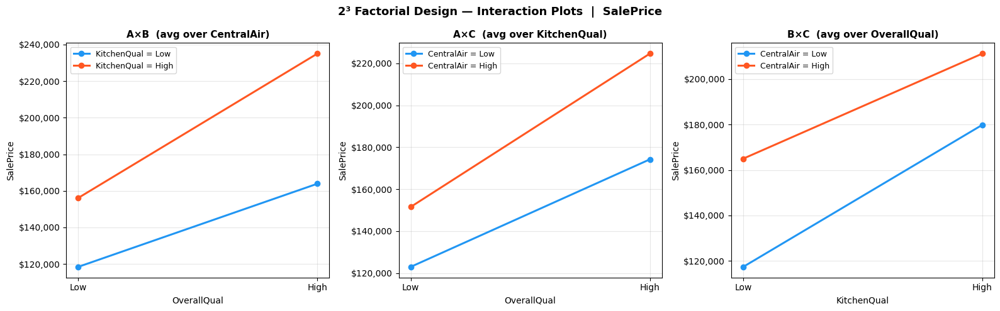

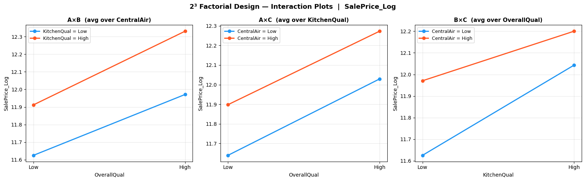

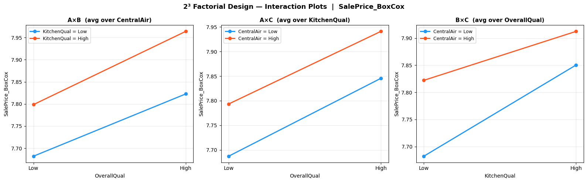

*Figure 11: Interaction plots for the $2^3$ factorial design on the three target scales (top: `SalePrice`; middle: `SalePrice_Log`; bottom: `SalePrice_BoxCox`). Each row shows the three two-way interactions $A \times B$, $A \times C$, and $B \times C$, averaged over the third factor.*

Reading these plots: **parallel lines** mean no interaction (the gap between the two levels of the modulating factor is constant); **diverging or converging lines** mean a moderate interaction (the gap grows or shrinks); **crossing lines** mean a strong interaction with sign reversal. The slope of the lines reflects the main effect of the primary factor; the gap between the lines reflects the main effect of the modulating factor; the change in gap reflects the interaction.

**A × B (averaged over `CentralAir`).** On `SalePrice`, the two lines (`KitchenQual = Low` in blue, `KitchenQual = High` in red) both slope strongly upward but **diverge** as `OverallQual` moves from Low to High. The gap grows from roughly $37k at Low to $72k at High — the two quality factors amplify each other (a kitchen upgrade is worth more on a high-quality house). This visual divergence corresponds to $A \times B = +\$16{,}740$, the largest two-way interaction on the original scale. On `SalePrice_Log` the divergence is much less pronounced (the lines stay nearly parallel), matching $A \times B = +0.0365$ ($+3.7\%$). On `SalePrice_BoxCox` the lines look essentially parallel ($A \times B = +0.0124$). The pattern is consistent in direction across the three scales (always positive) but its magnitude shrinks dramatically under transformation — a hallmark of a **multiplicative effect** that becomes nearly additive after the log transformation.

**A × C (averaged over `KitchenQual`).** On `SalePrice`, the two lines both slope upward with the red line slightly steeper, giving $A \times C = +\$10{,}925$. On `SalePrice_Log` the two lines appear essentially parallel, matching $A \times C = -0.0074$ ($-0.7\%$) — effectively zero. The Box-Cox scale tells the same story ($A \times C = -0.0054$). The visual reading confirms that $A \times C$ is the weakest of the three two-way interactions: the price gain from overall quality is roughly the same whether the house has central air or not. The slight positive value on the original scale is the only noticeable signal, and it disappears on the transformed scales.

**B × C (averaged over `OverallQual`).** On `SalePrice`, the two lines **converge** as `KitchenQual` moves from Low to High. The blue line is steeper than the red one: a kitchen upgrade adds more value to a house without central air ($62k jump) than to a house with central air ($46k jump). This convergence corresponds to $B \times C = -\$8{,}140$, the only **negative** two-way interaction. On `SalePrice_Log` the convergence is very visible — the blue line ends higher than expected, narrowing the gap significantly at `KitchenQual = High`. The estimate is $B \times C = -0.0941$ ($-9.9\%$), a substantial negative interaction. Same pattern on Box-Cox ($B \times C = -0.0389$). The economic reading: kitchen quality and central air act as **partial substitutes** — when one is present, the marginal value of the other decreases.

#### Effect magnitude bar charts

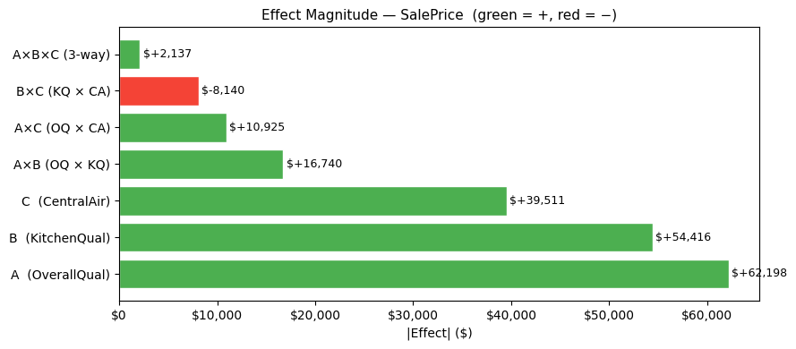

*(a) SalePrice*

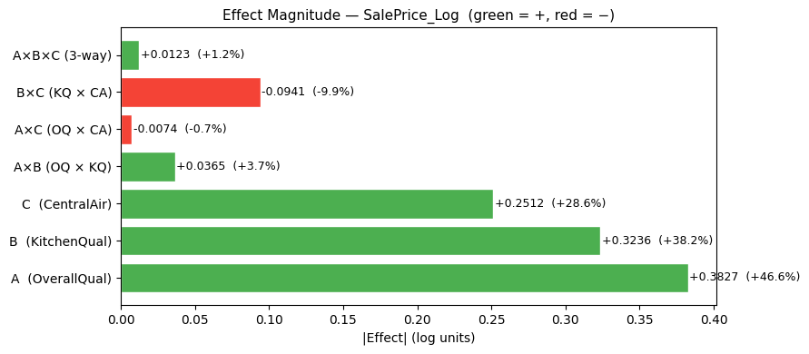

*(b) SalePrice_Log*

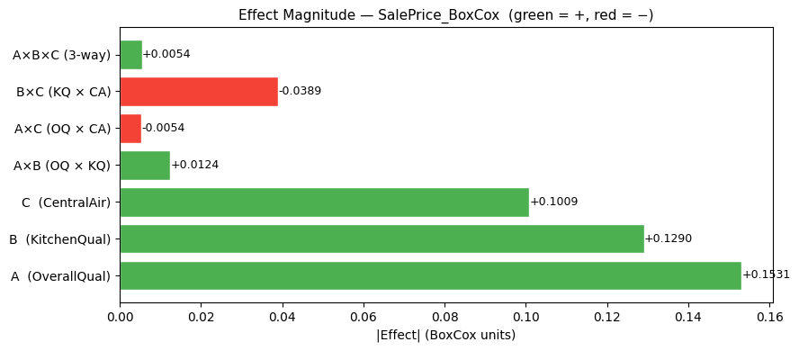

*(c) SalePrice_BoxCox*

*Figure 12: Effect magnitude bar charts per target. Green bars: positive effects (the High level increases price). Red bars: negative effects. The three main effects (A, B, C) dominate by an order of magnitude on every scale.*

#### Three-way interaction

The three-way interaction is **negligible on every target**: $+\$2{,}137$ on Original, $+0.0123$ ($+1.2\%$) on Log, $+0.0054$ on Box-Cox. In all three cases, the magnitude is an order of magnitude smaller than any two-way interaction and two orders smaller than any main effect. This means the two-way interactions *do not meaningfully change* depending on the level of the third factor — the "average over the third factor" approach used to compute them is fully justified. The price structure can therefore be summarised by the main effects and the two-way interactions, without needing to track higher-order coupling.

#### Comparative interpretation across the three targets

**The main effects ranking is identical and stable.** $A > B > C$ on every scale. The transformations change the magnitudes (dollars to log units to Box-Cox units) but never the order. This is the strongest signal of the analysis: the three factors carry genuine, scale-invariant influence on price.

**Interactions are systematically smaller on the transformed scales.** Compare $A \times B$: $+\$16{,}740$ (about 9% of A's main effect) on Original, but only $+3.7\%$ on Log and $+0.0124$ on Box-Cox. Same compression for $A \times C$ and $A \times B \times C$. The mechanism is well known: a transformation that compresses the right tail of `SalePrice` also compresses the multiplicative components of the data, which interactions encode. After transformation, much of what appeared as "interaction" becomes absorbed into additive main effects — the transformations are therefore not just useful for normality, they also reveal **how additive the structure really is** once the scale is corrected.

**B × C is the most robust feature of the design.** It remains negative on every target and visually clear in every interaction plot. Unlike $A \times B$ (where the magnitude shrinks under transformation), $B \times C$ even grows in relative importance on Log ($-9.9\%$ vs A's $+46.6\%$ = roughly 21% of A's effect, far larger than its relative size on the original scale). This makes $B \times C$ the only interaction that should be carried forward as a structural fact of the data — not an artefact of scale.

**A × C is weak and unstable.** Positive on Original ($+\$10{,}925$), nearly zero on Log ($-0.7\%$), nearly zero on Box-Cox ($-0.0054$). Its direction even flips between Original and the transformed scales, which is consistent with $A \times C$ being essentially absent from the price structure.

#### Operational verdict

The $2^3$ factorial design produces a clean, interpretable decomposition of price into:

- **Three substantial and stable main effects:** A (`OverallQual`) > B (`KitchenQual`) > C (`CentralAir`), each contributing a price premium in the tens of thousands of dollars range.
- **One robust negative two-way interaction:** $B \times C$, indicating that kitchen quality and central air act as partial substitutes in the price formation.
- **One scale-dependent positive two-way interaction:** $A \times B$, strong on the original scale but fading on the transformed scales — likely a multiplicative effect that the transformations absorb.
- **One negligible interaction:** $A \times C$, near zero on every scale.
- **No three-way coupling:** $A \times B \times C$ is negligible everywhere.

The dominant message is that **the price structure is overwhelmingly additive** in this binarised design, with one meaningful interaction ($B \times C$) modulating the additive sum. The factorial framework has successfully decomposed price into reusable building blocks: a fixed baseline (the grand mean), three independent quality premiums, and a single substitution effect between kitchen quality and central air.

---

## 6 Parametric Regression

This section marks the transition from exploratory analysis (Sections 3–5) to predictive modelling. We build a parametric linear model — Ordinary Least Squares (OLS) — using the features identified as significant by ANOVA in Section 4, supplemented with two numerical features capturing the size of the house. The model produces price predictions as a linear combination of these inputs; we inspect its coefficients, residual structure, and feature contributions before comparing it to regularised alternatives (Ridge, Lasso).

### 6.1 Model Specification

#### Composition of the feature set

We assemble 9 features for the regression:

- **7 ordinal quality features carried over from Section 4** — `OverallQual`, `ExterQual`, `BsmtQual`, `KitchenQual`, `FireplaceQu`, `CentralAir`, and `LotShape`. All seven were confirmed as significant drivers of price in the One-Way ANOVA of Section 4.2, so they form the natural categorical backbone of the model.
- **2 numerical features prescribed by the assignment** — `GrLivArea` (above-ground living area, in square feet) and `TotalBsmtSF` (total basement surface, in square feet). These introduce the **size** dimension of the house, which the 7 quality features cannot capture on their own. Two houses with identical quality ratings can differ dramatically in price simply because one is twice the size of the other — these two variables make that distinction available to the model.

The target variables are the usual three: `SalePrice`, `SalePrice_Log`, `SalePrice_BoxCox`.

#### Why ordinal encoding rather than one-hot

The 6 non-numerical features are **ordinal by nature**: there is a meaningful order from "worst" to "best" (Po < Fa < TA < Gd < Ex, or IR3 < IR2 < IR1 < Reg). We have two encoding choices:

- **One-hot encoding** would create a dummy column per level (e.g. 5 columns for `ExterQual`), turning each feature into a set of independent binary indicators. This discards the ordering information entirely — the model would treat `Ex` and `Po` as no more related than two unrelated colours — and it multiplies the number of columns from 9 to roughly 30, making interpretation heavier.
- **Ordinal encoding** maps the levels to consecutive integers (Po → 1, ..., Ex → 5), preserving the order and keeping the feature set compact. The linear model can then estimate a single coefficient per feature representing how much price moves per quality step.

We adopt **ordinal encoding** because the ordering itself is the primary signal carried by these features, and a parametric linear model is built to exploit exactly this kind of monotonic relationship.

#### The equal-step assumption

Ordinal encoding comes with a strong implicit assumption: by mapping Po → 1, Fa → 2, TA → 3, Gd → 4, Ex → 5, we tell the model that **the gap between Po and Fa is exactly the same as the gap between Gd and Ex**. In reality, the Tukey HSD tables in Section 4.3 already showed that adjacent-level price gaps are highly uneven — on `ExterQual` for `SalePrice`, for example, Fa → TA is +$56k, while TA → Gd is +$87k and Gd → Ex is +$136k.

We accept this simplification as a deliberate trade-off: the equal-step encoding is the price to pay for keeping the model linear, interpretable, and compact. The residual diagnostics in Section 6.3 will reveal whether the assumption causes systematic misfit.

#### The LotShape encoding — an assumed choice

The encoding IR3 → 1, IR2 → 2, IR1 → 3, Reg → 4 treats `LotShape` as if it had a genuine ordinal scale running from "most irregular" to "regular". This is a defensible but **debatable** choice: in the strict sense, IR1, IR2, IR3 describe degrees of irregularity but they do not form a perfectly linear quality ladder, and Section 4 hinted that the meaningful contrast might be **Regular vs Irregular** rather than a continuous gradation among irregulars. We keep the ordinal encoding here for uniformity with the other categorical features and let the subsequent analysis (coefficient size, p-value, residual behaviour) tell us whether this choice penalises the model.

#### Encoding pipeline and resulting dataframe

The code follows a 4-step pipeline. Six features get explicit integer mappings: the standard 5-level quality features (`ExterQual`, `KitchenQual`) follow `Po=1, Fa=2, TA=3, Gd=4, Ex=5`; the 6-level features with a `None` baseline (`BsmtQual`, `FireplaceQu`) follow `None=0, Po=1, ..., Ex=5`; `LotShape` follows `IR3=1, IR2=2, IR1=3, Reg=4`; `CentralAir` follows `N=0, Y=1`. `OverallQual` is already integer-valued (1–10) and needs no mapping. The 9 features and 3 targets are then copied from `train` into a working dataframe `df4`, with `fillna('None')` on the quality columns so that missing entries are treated as the "absence" category.

A sanity check confirms the encoded ranges: `OverallQual` ∈ [1, 10], `ExterQual` ∈ [2, 5], `BsmtQual` ∈ [0, 5], `KitchenQual` ∈ [2, 5], `FireplaceQu` ∈ [0, 5], `CentralAir` ∈ [0, 1], `LotShape` ∈ [1, 4], `GrLivArea` ∈ [334, 5642], `TotalBsmtSF` ∈ [0, 6110]. Note that these encoding ranges differ substantially across features, which has direct consequences for how raw coefficients should be read — a one-unit step on `OverallQual` (a 10-level scale) is not the same operation as a one-unit step on `CentralAir` (a 2-level scale). We return to this point when interpreting the coefficient tables below. The dataset has shape (1460, 12) with zero missing values.

### 6.2 Regression Results

#### Overall fit quality

We fit a separate OLS model on each of the three targets, using the 9 features without any interaction term. The summary statistics of the three fits are:

| Target | R² | Adj. R² | F | p(F) |
|---|---|---|---|---|
| `SalePrice` | 0.7786 | 0.7772 | 566.58 | ≈ 0 |
| `SalePrice_Log` | 0.8159 | 0.8147 | 713.85 | ≈ 0 |
| `SalePrice_BoxCox` | 0.8118 | 0.8106 | 694.83 | ≈ 0 |

Three immediate observations:

- **The global F-test rejects $H_0$ on every target** ($p \approx 0$), so the 9-feature model is globally meaningful on every scale.
- **Transformed targets fit better.** $R^2$ rises from 0.779 on the original scale to 0.816 on Log and 0.812 on Box-Cox, gaining roughly 4 percentage points. The same mechanism explored in Sections 3 and 4 is at work: compressing the heavy right tail of `SalePrice` reduces the variance the linear model has to absorb, leaving a cleaner residual structure (as the diagnostics in Section 6.3 will confirm).
- **The Log scale narrowly outperforms Box-Cox** (0.8159 vs 0.8118), reversing the order observed in Section 3 where Box-Cox achieved the cleaner Shapiro–Wilk and skewness scores. This reversal is small ($\Delta R^2 = 0.004$) and consistent with the Box-Cox parameter being close to zero ($\lambda \approx -0.0769$); for predictive purposes, Log and Box-Cox should be treated as equivalent on this dataset, with Log slightly preferable because of its direct dollar interpretation via `np.expm1`.

#### Coefficient tables (raw, per-feature units)

The tables below report the coefficient estimates, standard errors, t-statistics, and p-values for the three OLS fits. The coefficients here are reported **on the original feature scale** (one-unit increase on each feature in its own encoding), not standardised.

| Feature | Coef | Std Err | t | p-value |
|---|---|---|---|---|
| `OverallQual` | $+14,989.4 | $1,315.1 | 11.40 | 0.0000 *** |
| `ExterQual` | $+16,116.3 | $2,824.2 | 5.71 | 0.0000 *** |
| `BsmtQual` | $+5,809.3 | $1,593.4 | 3.65 | 0.0003 *** |
| `KitchenQual` | $+16,098.0 | $2,257.1 | 7.13 | 0.0000 *** |
| `FireplaceQu` | $+3,145.4 | $649.3 | 4.84 | 0.0000 *** |
| `CentralAir` | $+8,678.9 | $4,236.1 | 2.05 | 0.0407 * |
| `LotShape` | $−6,448.9 | $1,756.4 | −3.67 | 0.0002 *** |
| `GrLivArea` | $+47.7 | $2.5 | 19.12 | 0.0000 *** |
| `TotalBsmtSF` | $+25.5 | $2.9 | 8.69 | 0.0000 *** |

*Table 16: OLS coefficients on `SalePrice` (raw per-feature units). Significance: \*\*\* p < 0.001, \*\* p < 0.01, \* p < 0.05, . p < 0.10.*

| Feature | Coef (log + %) | Std Err | t | p-value |
|---|---|---|---|---|
| `OverallQual` | +0.0883 (+9.2%) | 0.0060 | 14.64 | 0.0000 *** |
| `ExterQual` | +0.0491 (+5.0%) | 0.0130 | 3.79 | 0.0002 *** |
| `BsmtQual` | +0.0402 (+4.1%) | 0.0073 | 5.51 | 0.0000 *** |
| `KitchenQual` | +0.0739 (+7.7%) | 0.0104 | 7.14 | 0.0000 *** |
| `FireplaceQu` | +0.0199 (+2.0%) | 0.0030 | 6.67 | 0.0000 *** |
| `CentralAir` | +0.2020 (+22.4%) | 0.0194 | 10.40 | 0.0000 *** |
| `LotShape` | −0.0412 (−4.2%) | 0.0081 | −5.11 | 0.0000 *** |
| `GrLivArea` | +0.0002 (+0.0%) | 0.0000 | 19.40 | 0.0000 *** |
| `TotalBsmtSF` | +0.0001 (+0.0%) | 0.0000 | 7.42 | 0.0000 *** |

*Table 17: OLS coefficients on `SalePrice_Log` (raw per-feature units). The "%" annotation gives the percentage equivalent $e^\beta - 1$ per unit increase in the feature.*

| Feature | Coef | Std Err | t | p-value |
|---|---|---|---|---|
| `OverallQual` | +0.0353 | 0.0024 | 14.60 | 0.0000 *** |
| `ExterQual` | +0.0181 | 0.0052 | 3.49 | 0.0005 *** |
| `BsmtQual` | +0.0161 | 0.0029 | 5.49 | 0.0000 *** |
| `KitchenQual` | +0.0288 | 0.0041 | 6.94 | 0.0000 *** |
| `FireplaceQu` | +0.0079 | 0.0012 | 6.60 | 0.0000 *** |
| `CentralAir` | +0.0858 | 0.0078 | 11.02 | 0.0000 *** |
| `LotShape` | −0.0164 | 0.0032 | −5.08 | 0.0000 *** |
| `GrLivArea` | +0.0001 | 0.0000 | 19.02 | 0.0000 *** |
| `TotalBsmtSF` | +0.0000 | 0.0000 | 7.18 | 0.0000 *** |

*Table 18: OLS coefficients on `SalePrice_BoxCox` (raw per-feature units).*

#### Interpretation of the coefficients

**Every feature is statistically significant.** All 9 coefficients have $p < 0.05$ on all three targets, and 8 of the 9 are below $p < 0.001$. The only marginally significant case is `CentralAir` on the original scale ($p = 0.041$, three orders of magnitude weaker than its significance on Log and Box-Cox, where $p < 10^{-23}$). This is the first signal that `CentralAir` is much more visible to the model once the price scale is normalised — the $\eta^2$ analysis below quantifies this further.

**The dollar interpretation on `SalePrice` reads directly, but per-step coefficients are not directly comparable.** Each unit increase in an ordinal feature translates into an absolute dollar amount: a one-step jump on `KitchenQual` (e.g. from `TA` to `Gd`) corresponds to +$16,098, a one-step jump on `OverallQual` corresponds to +$14,989, and a one-step jump on `ExterQual` corresponds to +$16,116. An additional square foot of living area contributes +$47.7 and an additional square foot of basement contributes +$25.5 — a coherent ranking where above-ground living space is worth roughly twice basement space per square foot.

However, a per-step coefficient is **not an indicator of overall importance**, because the features do not share the same encoding range. `OverallQual` runs over 10 levels (1–10), `ExterQual` over 4 observed levels (2–5), `CentralAir` over 2 levels (0–1), and `GrLivArea` over thousands of square feet (334–5,642). A feature with a smaller per-unit coefficient but a much wider range can still dominate the total predicted variance — which is precisely the case for `GrLivArea`, as the $\eta^2$ table below makes clear. The standardised-coefficient table in Section 6.2 (Ridge/Lasso comparison) re-expresses every coefficient as "effect per one standard deviation of the feature", which is the unit needed to compare contributions across features.

**The log scale exposes a counter-intuitive ranking.** On `SalePrice_Log`, the largest coefficient by magnitude is `CentralAir` at +0.2020, equivalent to a +22.4% price premium for a binary jump. This is far larger in relative terms than the per-unit effect of any quality variable (`OverallQual` contributes only +9.2% per step). The reason this was invisible on the original scale is that the `CentralAir` contrast is binary — a single 0 → 1 jump cannot accumulate dollar magnitude the way a multi-step ordinal can — so its dollar coefficient looks small. The log transformation expresses every coefficient as a **relative price change**, which makes the binary jump directly comparable to the per-step quality jumps, and the comparison clearly favours `CentralAir`.

**The `LotShape` coefficient is negative on every target.** The values are −$6,449 (Original), −0.0412 (Log, −4.2%), and −0.0164 (Box-Cox), all highly significant ($p < 0.001$). Given the chosen encoding direction (1 = very irregular, 4 = regular), **the negative sign means the model predicts a slightly lower price as the lot becomes more regular, all else equal.** This contradicts the intuitive expectation that regular lots should command a premium. Two non-exclusive explanations are consistent with the rest of the project:

- **The equal-step assumption is misfitting `LotShape`.** The Tukey analysis in Section 4.3 already established that the four levels do not form a clean monotonic ladder — the three irregular levels were merged into one indistinguishable cluster on the transformed scales, while `Reg` stayed separate. Forcing a linear coefficient on a non-linear contrast can produce a sign that does not reflect the true marginal effect.
- **Confounding with `GrLivArea`.** Larger and higher-end properties are sometimes built on irregular lots (corner plots, oversized irregular parcels, premium suburban developments). Once `GrLivArea` is controlled for, the residual effect of regularity may be negative because regularity correlates with smaller, denser-suburb properties.

The $\eta^2$ ranking below will show that `LotShape` carries very little explained variance regardless of its sign, so the interpretation is informative but not decisive for predictive performance.

#### ANOVA Type II — which features explain the most variance

The coefficients tell us **how** each feature shifts the prediction, but not **how much** variance it explains. We run an ANOVA Type II on each fitted model to decompose the total Sum of Squares per feature. The choice of Type II is the same as in Section 4.3: it tests each effect after accounting for all other effects simultaneously, which is the correct option for an unbalanced design where features may share information. The table below consolidates the F-statistics and $\eta^2$ values across the three targets.

| Feature | F (Orig.) | η² (Orig.) | F (Log) | η² (Log) | F (BC) | η² (BC) |
|---|---|---|---|---|---|---|
| `GrLivArea` | 365.62 | 0.5158 | 376.26 | 0.4089 | 361.68 | 0.3983 |
| `OverallQual` | 129.92 | 0.1833 | 214.34 | 0.2329 | 213.27 | 0.2349 |
| `TotalBsmtSF` | 75.45 | 0.1064 | 55.11 | 0.0599 | 51.59 | 0.0568 |
| `KitchenQual` | 50.87 | 0.0718 | 51.01 | 0.0554 | 48.21 | 0.0531 |
| `ExterQual` | 32.56 | 0.0459 | 14.38 | 0.0156 | 12.21 | 0.0134 |
| `FireplaceQu` | 23.47 | 0.0331 | 44.48 | 0.0483 | 43.58 | 0.0480 |
| `LotShape` | 13.48 | 0.0190 | 26.12 | 0.0284 | 25.81 | 0.0284 |
| `BsmtQual` | 13.29 | 0.0188 | 30.31 | 0.0329 | 30.13 | 0.0332 |
| `CentralAir` | 4.20 | 0.0059 | 108.17 | 0.1176 | 121.49 | 0.1338 |

*Table 19: F-statistics and share of explained variance ($\eta^2$) per feature from the Type II ANOVA decomposition. All p-values are below 0.05, so every estimate is statistically supported.*

**`GrLivArea` dominates by a wide margin.** Living area alone carries **51.6% of the explained variance on the original scale** and roughly 40% on the transformed scales, with an F-statistic of 365 on Original (a factor 2.8 above the second-ranked feature). The two numerical size variables (`GrLivArea` + `TotalBsmtSF`) together account for $\eta^2 = 0.62$ on the original scale, leaving the 7 quality features collectively responsible for only the remaining 0.16. The implication is clear: **size, not quality, is the dominant explanatory dimension** for an Ames house price. This validates the assignment's choice to require these two numerical features alongside the quality backbone — without them the model would be missing the principal axis of variation.

**`CentralAir` undergoes a spectacular rank change under transformation.** On the original scale it contributes only $F = 4.20$ and $\eta^2 = 0.0059$ (the weakest of all 9 features); on Log and Box-Cox the F-statistic jumps to 108.17 and 121.49 respectively — **a factor 26–29 increase** that elevates `CentralAir` to the third-largest contributor on the transformed scales ($\eta^2 = 0.118$ and 0.134). This mirrors the coefficient observation above. The mechanism is the one observed throughout the project: the heavy right tail of `SalePrice` inflates within-group variance and drowns the binary `CentralAir` signal under noise on the original scale; once the scale is normalised, the contrast — which is large in relative terms — can dominate. **The transformation does not change the underlying physical effect of central air on price; it changes our ability to measure it cleanly.**

**The ranking of quality features is broadly stable.** `OverallQual` is second on every target, `KitchenQual` stays near the top of the quality features, and `LotShape` stays near the bottom. `ExterQual` loses ground under transformation ($\eta^2$: 0.046 → 0.016, $F$: 32.6 → 14.4), which is interesting given that it was the strongest one-way F-statistic in Section 4.2 ($F \approx 443$). The interpretation is that `ExterQual` is highly correlated with the other quality features and with `OverallQual` in particular, so once those are in the model, its unique contribution (which is what Type II measures) becomes modest.

#### Comparison with regularised regression (Ridge and Lasso)

To verify whether the OLS coefficients are stable and whether any feature could be dropped without performance loss, we fit Ridge and Lasso models on **standardised features** (`StandardScaler`, so every feature has mean 0 and standard deviation 1) and compare with OLS via 5-fold cross-validated $R^2$. The optimal regularisation strength $\alpha$ is selected by cross-validation.

**Important reading note — coefficients here are not the same as in Tables 16–18.** The coefficients in this comparison are expressed in **standardised units**: each $\beta$ is the price change per one standard deviation of the feature, not per one unit on its native encoding. To make the OLS coefficients comparable to Ridge/Lasso (which are estimated on standardised features), we rescale them by the feature standard deviations ($\beta_j^{\text{std}} = \beta_j^{\text{raw}} \times \sigma_j$). This is why the OLS `OverallQual` coefficient on Original appears as +$20,723 here but as +$14,989 in Table 16 — the same model, two different units. Standardised coefficients are the unit needed for **ranking feature importance**; raw coefficients are the unit needed for **predicting price given a feature value**.

| Target | Model | R² (train) | R² (CV) | Alpha |
|---|---|---|---|---|
| `SalePrice` | OLS | 0.7786 | — | — |
| `SalePrice` | Ridge | 0.7778 | 0.7671 | 123.2847 |
| `SalePrice` | Lasso | 0.7784 | 0.7686 | 628.0291 |
| `SalePrice_Log` | OLS | 0.8159 | — | — |
| `SalePrice_Log` | Ridge | 0.8153 | 0.8047 | 89.0215 |
| `SalePrice_Log` | Lasso | 0.8157 | 0.8054 | 0.0031 |
| `SalePrice_BoxCox` | OLS | 0.8118 | — | — |
| `SalePrice_BoxCox` | Ridge | 0.8112 | 0.8006 | 89.0215 |
| `SalePrice_BoxCox` | Lasso | 0.8116 | 0.8015 | 0.0012 |

*Table 20: Training $R^2$ and 5-fold cross-validated $R^2$ for OLS, Ridge, and Lasso on the three targets. Ridge and Lasso are fit on standardised features.*

**OLS does not overfit.** The gap between training $R^2$ and cross-validated $R^2$ is only about 0.01 on every target (0.7786 → 0.7671 for Ridge on `SalePrice`; 0.8159 → 0.8047 for Ridge on Log). This is a very small generalisation gap, which is consistent with the feature-to-observation ratio (9 features, 1460 observations) being healthy. Regularisation is therefore not needed for variance reduction — the OLS estimates are already stable.

**Lasso retains all 9 features on every target.** No coefficient is shrunk to exactly zero, which is the clean answer Lasso provides to the question "can any feature be dropped?". The answer here is **no**: every feature in the set carries genuinely independent information, with no redundancy that variable selection could exploit. This justifies, after the fact, the feature-engineering choices made in Section 4 (keeping only the 7 ANOVA-significant ordinal features) and in the assignment (adding the two size variables).

**Coefficient signs and rankings are identical across the three methods.** The structural conclusions of the OLS analysis — the negative sign on `LotShape`, the dominance of `GrLivArea` and `OverallQual` in standardised terms, the scale-dependent prominence of `CentralAir` — carry over unchanged to Ridge and Lasso. Ridge slightly attenuates the largest coefficients (e.g. `OverallQual` from +$20,723 in OLS-standardised to +$18,979 in Ridge on `SalePrice`), as expected from its $L^2$ shrinkage, but the qualitative picture is preserved.

**Conclusion of the regularised comparison.** OLS is the appropriate choice for this problem: the feature set is well-calibrated, the model does not overfit, and no regularisation-based pruning is warranted. Ridge and Lasso confirm rather than replace the OLS analysis.

### 6.3 Model Diagnostics

The previous subsection established that the model fits the data well in aggregate ($R^2 \approx 0.78$–$0.82$). What it does not yet establish is whether the OLS assumptions — linearity, homoscedasticity, normally distributed residuals — actually hold. If they fail, the $R^2$ remains a valid measure of in-sample fit but the standard errors, t-statistics, and confidence intervals reported above become unreliable. We examine three diagnostic plots per target and complement them with a formal Shapiro–Wilk test on the residuals.

**Note on what is being tested here.** The Shapiro–Wilk test was already used in Section 3 to verify the normality of `SalePrice` itself — a property of the **marginal** distribution of the target. The test we run now addresses a structurally different question: whether the regression **residuals** $\varepsilon_i = y_i - \hat{y}_i$ are normally distributed — a property of the **conditional** distribution of $Y | X$. A non-normal target can produce normal residuals (if the model captures the non-normality via the features) and vice versa. The normality of residuals, not the normality of $Y$, is what determines whether the OLS p-values and confidence intervals in Tables 16–18 can be trusted at face value.

**Diagnostic plots.** We examine three plots per target:

- **Residuals vs Fitted.** A horizontal cloud centred on zero indicates that the linear specification captures the systematic component. A funnel shape, a curve, or a trend signals misfit.
- **Normal Q-Q plot.** The quantiles of the residuals are plotted against the theoretical normal quantiles. Alignment with the reference line indicates approximately normal residuals.
- **Scale-Location.** Plots $\sqrt{|\text{standardised residuals}|}$ against fitted values. A horizontal cloud confirms homoscedasticity; a rising or trending shape signals heteroscedasticity.

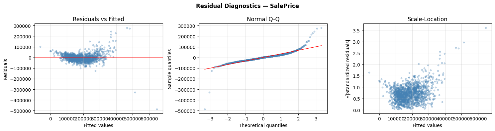

*SalePrice (original scale)*

*SalePrice_Log*

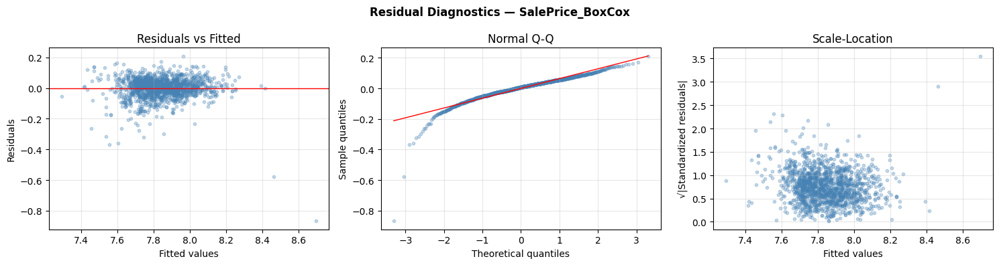

*SalePrice_BoxCox*

*Figure 13: Residual diagnostics for the OLS model on each target. Top: `SalePrice`; middle: `SalePrice_Log`; bottom: `SalePrice_BoxCox`. For each target, from left to right: Residuals vs Fitted, Normal Q-Q plot, and Scale-Location.*

**Shapiro–Wilk verdicts.** The formal test results on the residuals of the three OLS fits are:

| Target | W | p | Verdict |
|---|---|---|---|
| `SalePrice` | 0.8117 | 3.05 × 10⁻³⁸ | non-normal × |
| `SalePrice_Log` | 0.8753 | 1.22 × 10⁻³² | non-normal × |
| `SalePrice_BoxCox` | 0.8711 | 4.52 × 10⁻³³ | non-normal × |

The formal test **rejects normality on all three targets**, including Log and Box-Cox where the visual diagnostics looked acceptable. We address the apparent contradiction below.

**On `SalePrice` (original scale) — diagnostics fail visually and formally.** The **Residuals vs Fitted** plot displays a clear cone-shaped pattern: the spread of residuals is tight at low fitted values (around ±$30k for predictions of $100k–$200k) but expands dramatically as fitted values grow (residuals of ±$100k+ for predictions of $400k, and individual outliers reaching nearly −$500k at $650k). This is textbook **heteroscedasticity**: the variance of the errors is not constant but grows roughly proportionally with the predicted value. The **Normal Q-Q plot** confirms a heavy-tail problem in both directions: the upper-right tail rises sharply above the reference line, indicating a small number of houses whose actual price is much higher than the model predicts; the lower-left tail drops below the line, indicating houses whose actual price is much lower. The **Scale-Location plot** repeats the heteroscedasticity verdict from a different angle: the cloud trends upward as fitted values grow. The Shapiro–Wilk verdict ($W = 0.81$, $p \approx 10^{-38}$) confirms the visual reading.

**On `SalePrice_Log` — diagnostics visually clean, formal test still rejects.** The **Residuals vs Fitted** plot is dramatically improved: the cloud is centred on zero across the entire range of fitted values (from $\sim 10.5$ to $\sim 13.5$ in log units, i.e. $36k to $725k in dollar terms), and the spread is largely uniform. A small number of negative outliers (residuals around $-1.5$ to $-2$ log units, i.e. houses that sold for 75–85% below the model's prediction) remain visible at low fitted values but no longer dominate the plot. The **Normal Q-Q plot** closely tracks the reference line from theoretical quantile $-2$ to $+2$, which covers about 95% of the residual mass; deviation remains visible only in the extreme lower tail. The **Scale-Location plot** shows a roughly horizontal cloud, confirming that the heteroscedasticity observed on the original scale is essentially resolved.

The **Shapiro–Wilk test, however, still rejects normality** ($W = 0.875$, $p \approx 10^{-32}$). The apparent contradiction with the visual reading is real and worth examining. Two mechanisms are at work. First, on $N = 1460$ observations **the Shapiro–Wilk test has very high statistical power**: it detects even small departures from normality that are invisible to the eye — here, the residual mass in the extreme lower tail (the 10–20 distressed-sale outliers identified in the Q-Q plot) is enough to push the p-value below any conventional threshold, even though it represents about 1% of the data. Second, **OLS inference is robust to mild violations of residual normality in the large-sample regime**: by the Central Limit Theorem applied to coefficient estimators, the t-statistics in Tables 17–18 remain approximately normally distributed even when the underlying residuals are not strictly Gaussian, provided the residuals have finite variance — which they do here. In practice, this means the p-values can still be interpreted at face value for the bulk of the residual distribution; only inference on the extreme lower tail (the distressed-sale outliers) is genuinely uncertain.

**On `SalePrice_BoxCox` — diagnostics match Log.** The three plots tell the same story as on the Log target, with no meaningful qualitative difference, and the Shapiro–Wilk verdict ($W = 0.871$, $p \approx 10^{-33}$) matches the Log result. This is expected: the optimal Box-Cox $\lambda \approx -0.0769$ is close to zero (the value at which Box-Cox becomes a logarithm). For diagnostic purposes, Log and Box-Cox are interchangeable here.

#### What the diagnostics tell us about the modelling strategy

Three actionable conclusions emerge from the residual analysis:

- **The transformations are not optional — they are required.** The original-scale model produces formally significant coefficients ($p < 0.001$ for 8 of 9 features) and an apparently respectable $R^2 = 0.78$, but its residual structure violates the homoscedasticity assumption so clearly that the reported standard errors are biased downward. The transformed targets both fix the heteroscedasticity and produce a better fit ($R^2 \approx 0.82$). Reporting the original-scale model alone would have been misleading.
- **The equal-step ordinal encoding does not cause visible systematic misfit on the transformed scales.** The Residuals vs Fitted plots on Log and Box-Cox show no curvature, no fanning, and no banding that would betray a non-linear relationship between an ordinal feature and the target. The deliberate simplification accepted in Section 6.1 is therefore vindicated — the model is not fighting the data.
- **Residual normality is formally rejected on every scale, but does not undermine the inference on Log/Box-Cox.** The Shapiro–Wilk verdict on the transformed targets reflects the high power of the test on $N = 1460$ and a small population of low-end outliers (about 10–20 houses whose actual price is much lower than the model predicts). These outliers cannot be eliminated by a different choice of transformation — they reflect a real phenomenon at the bottom of the housing market that the available features simply do not capture, and they are the same kind of cases the neural network in Section 7 will encounter. For the bulk of the residual distribution, OLS inference on Log and Box-Cox remains usable thanks to the large-sample robustness of the t-tests.

#### Operational verdict

The parametric regression analysis produces the following findings:

- **The model is globally significant on all three targets**, with $R^2 = 0.78$ (Original), 0.82 (Log), 0.81 (Box-Cox). Every feature contributes a significant coefficient.
- **The transformed targets are the appropriate scales for the linear model.** The original scale violates the homoscedasticity assumption catastrophically; the transformations restore it almost entirely, and large-sample robustness compensates for the residual normality the formal test still rejects.
- **The dominant explanatory feature is `GrLivArea`**, with $F = 365$ and $\eta^2 = 0.52$ on the original scale — by a factor 2.8 above the second-ranked feature. The 7 quality features collectively account for less than the two size variables, validating the assignment's choice of including `GrLivArea` and `TotalBsmtSF` alongside the ANOVA-significant ordinal backbone.
- **`CentralAir` is the most scale-sensitive feature**, with its F-statistic increasing by a factor 26–29 between Original ($F = 4.20$) and Log/Box-Cox ($F = 108$ and $F = 121$). This is consistent with the rest of the project: the heavy right tail of `SalePrice` masks effects that the transformed scales correctly expose.
- **The model is stable and the feature set is well-calibrated.** Ridge and Lasso match OLS within 0.01 on cross-validated $R^2$, Lasso retains every feature, and all three methods agree on signs and rankings when read in standardised units.
- **The negative `LotShape` coefficient is real but minor.** It reflects either the imperfect equal-step encoding of an essentially non-monotonic feature, or confounding with size. The feature contributes little explained variance, so the interpretive ambiguity does not affect predictive performance.

This OLS model, with $R^2 \approx 0.82$ on the transformed targets, sets the parametric benchmark that the non-parametric neural network of Section 7 will aim to surpass by exploiting the full 79-feature space and non-linear interactions that OLS cannot represent.

---

## 7 Neural-Network Regression

This section marks a fundamental shift in methodology. Up to now, every model and analysis assumed a specific functional form — **linearity** in OLS, **additivity** in ANOVA, **equal-step distances** in ordinal encoding, predefined effect contrasts in the factorial design. These assumptions made the analysis interpretable but also imposed strong structural constraints on what the data could tell us. A **Multi-Layer Perceptron (MLP)**, in contrast, is a **non-parametric** model: it makes almost no assumption about how features relate to the target and learns the mapping directly from data through stacked non-linear transformations.

This section also produces the final **Kaggle submission** of the project. The competition evaluates submissions using the Root Mean Squared Error (RMSE) between the predicted and observed $\log(\text{SalePrice})$, so the metric itself operates on the log scale, not on raw dollars. We therefore train the network on `SalePrice_Log` for two converging reasons: **alignment with the Kaggle metric** (the loss we minimise is exactly the quantity Kaggle judges), and **consistency with the analytical findings from Sections 3–6** (the log transformation reduces skewness from 1.883 to 0.121, compresses outliers, stabilises variance across price ranges, and makes feature effects more nearly additive — all properties an MLP benefits from). The final submission back-converts the predictions via `np.expm1` to recover dollar amounts; the pair `log1p`/`expm1` is mathematically exact, so no information is lost in the round-trip.

### 7.1 Model Inputs and Preprocessing

#### Feature inspection

Sections 4–6 worked on a hand-picked subset of 9 features (7 ordinal qualities plus `GrLivArea` and `TotalBsmtSF`). This section follows the assignment's mandate to leverage **all available features**: we reload `train.csv` and `test.csv` from scratch and keep every column except `Id` (no predictive signal — the test `Id`s are saved aside as `test_ids` for the submission file) and `SalePrice` (the target). The resulting input space contains **79 features**: 36 numerical (continuous quantities like `GrLivArea`, `LotArea`, `YearBuilt`, plus integer-coded ordinals like `OverallQual`) and 43 categorical (text-valued attributes such as `Neighborhood`, `HouseStyle`, and all the quality grades). This is roughly 9× more raw input information than the linear model used, at the cost of a substantial volume of missing values that must be handled robustly.

The missing-value pattern splits into three regimes. **Massive missingness with clear semantics** ("feature is genuinely absent"): `PoolQC` 99.5%, `MiscFeature` 96.3%, `Alley` 93.8%, `Fence` 80.8%, `FireplaceQu` 47.3%. **Moderate missingness, also semantic**: `MasVnrType` (59.7%), the five `Garage*` features (~5.5% each, consistent across columns confirming a single mechanism — no garage), the five `Bsmt*` features (~2.5% each, no basement). **True missing data**, the only column where NaN plausibly means "this measurement is missing" rather than "the feature is absent": `LotFrontage` (17.7% on train, 15.6% on test). The pattern is highly consistent between train and test — no surprise NaN columns appear in test that the pipeline would not have seen during training.

The categorical cardinality profile is dominated by `Neighborhood` (25 levels), `Exterior2nd` (16), `Exterior1st` (15), followed by `Condition1`, `SaleType` (9 each) and a tail of features with 6–8 levels. The 43 categorical features sum to 251 distinct levels, which after one-hot encoding will expand the feature space to a few hundred columns.

#### Preprocessing pipeline

Three preprocessing operations must be applied in a strict order on a neural-network feature set: **impute missing values, encode categoricals, standardise numerics**. Doing these manually introduces two recurring bugs — inconsistency between train and test (forgetting to apply the same medians and category mappings), and information leakage (computing statistics on train and test combined). The `sklearn.Pipeline + ColumnTransformer` pattern eliminates both risks structurally: every transformation is **fit on train only**, and the fitted parameters are then transformed onto test.

- **Numerical pipeline (36 columns):** `SimpleImputer(strategy='median')` → `StandardScaler`. Median imputation is robust to the heavy-tailed columns (`LotArea`, `GrLivArea`); standardisation puts every feature on a common (mean 0, std 1) footing, which is critical for an MLP — without scaling, features measured in thousands (`LotArea`) would dominate the gradient while features measured in single digits (`OverallQual`) would barely contribute.
- **Categorical pipeline (43 columns):** `SimpleImputer(strategy='constant', fill_value='Missing')` → `OneHotEncoder(handle_unknown='ignore', sparse_output=False)`. The constant-string imputation preserves the semantic distinction between "feature absent" and the other levels rather than collapsing it into the most-frequent class. The `handle_unknown='ignore'` policy is a safety net at prediction time: if the test set contains a level absent from train, the affected row is encoded as a zero-vector across all known levels rather than crashing.

#### Unknown category detection in test

The `'ignore'` fallback is silent by default — the model would receive zero-vectors without us knowing. To stay informed, we explicitly compare the test set's categorical levels against the levels the encoder learned from train. The audit detected **7 categorical features where test contains a level absent from train**: `MSZoning` (4 rows), `Utilities` (2), `Exterior1st` (1), `Exterior2nd` (1), `KitchenQual` (1), `Functional` (2), `SaleType` (1). In every case the unknown level is `'Missing'` — a known asymmetry in the Kaggle House Prices dataset: these 7 columns have no NaN in train but do have NaN in test. Our imputer faithfully labels them `'Missing'` on both sides, but because the level never appeared in train, the encoder never learned it. The affected observations total at most **12 test rows out of 1459 (≈ 0.8%)**, most with only one unknown column out of 43, so the rest of each row's encoded vector is well-formed. We accept the zero-vector fallback rather than injecting the `'Missing'` level into train artificially: the volume is negligible (impact on RMSE in the noise), the semantics of a zero-vector are interpretable ("no positive evidence for any known level"), and modifying the training set would break the train/test separation.

#### Resulting input dimensions

The 79 raw features expand to **303 numerical columns**: the 36 numerical features standardised in place, and the 43 categorical features expanded into 267 one-hot columns (an average of 6.2 levels per categorical feature). Train shape (1460, 303), test shape (1459, 303), zero remaining NaN on either side. The 5:1 ratio of observations to columns is comfortable for an MLP with L2 regularisation and early stopping.

### 7.2 Training and Validation

#### Baseline model

We first fit a baseline MLP to establish a reference point: architecture `(128, 64)` (two hidden layers), ReLU activations, Adam optimiser, $\alpha = 10^{-3}$ (modest L2 regularisation), `learning_rate_init=10^{-3}`, early stopping with `validation_fraction=0.1` and `n_iter_no_change=20`. Evaluated on a single external 20% validation split held out from training, the baseline reaches **RMSE = 0.1724** and **$R^2 = 0.8407$** on this validation split. The numbers are taken at face value here but with one caveat: a single random split gives a noisy estimate of generalisation performance, easily ±0.02 in RMSE depending on which observations end up in the holdout. The tuning step that follows replaces this single-split protocol with cross-validation precisely to obtain a more reliable headline number.

#### Hyperparameter tuning via GridSearchCV

The baseline hyperparameters were sensible defaults, but not data-justified. We search systematically over a compact grid of **18 combinations**, focused on the three hyperparameters that materially affect MLP performance: `hidden_layer_sizes` ∈ {`(64,)`, `(128, 64)`, `(256, 128, 64)`} (shallow vs. medium vs. deep), $\alpha$ ∈ {$10^{-4}, 10^{-3}, 10^{-2}$} (three orders of magnitude of regularisation), and `learning_rate_init` ∈ {$10^{-3}, 5 \times 10^{-4}$}. All other hyperparameters (activation, solver, early-stopping policy, random seed) are held constant.

**Protocol — 100% of training data, no external split.** Step 3-bis abandons the 20% external validation split and uses the **entire training set** for both the hyperparameter search and the final model fit. Three justifications: **data efficiency** (with only 1460 observations, every row counts — reserving 292 of them as an untouched holdout means GridSearchCV evaluates each combination on a smaller pool); **honesty preserved by cross-validation** (each candidate is evaluated by 3-fold CV inside `GridSearchCV`, so every hyperparameter score is averaged over 3 distinct held-out subsets — the CV RMSE is an honest estimate of out-of-sample performance); and **final refit on 100%** (once the best configuration is identified, `GridSearchCV` automatically refits it on the full training set via `refit=True`). The trade-off: we no longer have a single fresh held-out number to compare against; instead, the CV RMSE of the winning configuration is the most reliable estimate of generalisation performance.

**Winning configuration.** The grid search identified `hidden_layer_sizes=(64,)`, `alpha=10⁻²`, `learning_rate_init=10⁻³`, with a **best CV RMSE on log scale of 0.1821**. The most striking finding is the architectural choice: the winning model is the **shallowest and smallest option in the grid** — a single hidden layer of 64 neurons. Both `(128, 64)` and `(256, 128, 64)` performed worse on cross-validation. This is a clear signal that the dataset does not warrant a deep network: with 1460 observations and a feature space dominated by sparse one-hot indicators (267 of 303 columns), additional capacity becomes **noise capacity** rather than signal capacity. The strong regularisation ($\alpha = 10^{-2}$, the highest value tested) reinforces this reading — the optimum sits at the boundary of the grid where shrinkage is most aggressive.

**Robustness — top-5 analysis.** The five best configurations all share the same architecture and differ only in $\alpha$ and learning rate:

| Rank | Architecture | α | lr | RMSE | Std |
|---|---|---|---|---|---|
| 1 | (64,) | 10⁻² | 10⁻³ | 0.1821 | 0.0264 |
| 2 | (64,) | 10⁻³ | 10⁻³ | 0.1829 | 0.0265 |
| 3 | (64,) | 10⁻⁴ | 10⁻³ | 0.1831 | 0.0266 |
| 4 | (64,) | 10⁻² | 5×10⁻⁴ | 0.1852 | 0.0258 |
| 5 | (64,) | 10⁻³ | 5×10⁻⁴ | 0.1858 | 0.0259 |

Three readings emerge. The architectural choice `(64,)` is robust — every top-ranked candidate agrees on it. The exact value of $\alpha$ matters less than the architecture: RMSE varies by only 0.001 over three orders of magnitude. `learning_rate_init = 10⁻³` consistently beats `5×10⁻⁴`. The high standard deviation across CV folds (≈ 0.026) compared to the gap between candidates (≈ 0.001) means the top 3 are practically equivalent and the winner could shift between random seeds.

**Final model behaviour and baseline comparison.** After refitting on the full training set, the tuned model stops at **304 iterations** out of 500 max (early stopping triggered cleanly), with final training loss 0.006165 — higher than the baseline's 0.002017, which is expected and desirable: the higher loss reflects the stronger regularisation, which trades a bit of training fit for better generalisation. In-sample predictions reach **RMSE = 0.0884 log units, $R^2 = 0.9510$** on the training set, MAE ≈ $10,675, RMSE ≈ $15,899 in dollars. These in-sample numbers are biased upward by construction (the model has seen this data during training); the true expected performance on unseen data is closer to the CV RMSE of 0.1821 — about twice the in-sample value, a normal generalisation gap for a regularised MLP on a dataset of this size.

At first glance the tuned model looks **worse** than the baseline (RMSE 0.1821 vs. 0.1724). But the comparison is misleading: the baseline number comes from a single random split that may have favoured the model by luck, while the tuned number is an average over 3 folds, far more reliable. The CV RMSE is the number we should trust for the Kaggle expectation, and the tuned model is more principled — every hyperparameter is justified by the data rather than picked *a priori*.

#### Residual diagnostics on the tuned MLP

Before generating the Kaggle submission, we audit the structure of the residuals. A model can achieve a low average RMSE while still exhibiting systematic biases — over-predicting cheap houses, under-predicting luxury houses, producing variance that grows with the predicted value. The diagnostics detect such patterns. One caveat: unlike Section 6 where we had a clear in-sample / out-of-sample distinction, all residuals here are computed in-sample (Protocol B). The diagnostics report on how well the model fits the training data, not on how well it generalises — the honest estimate of generalisation performance remains the CV RMSE of 0.1821.

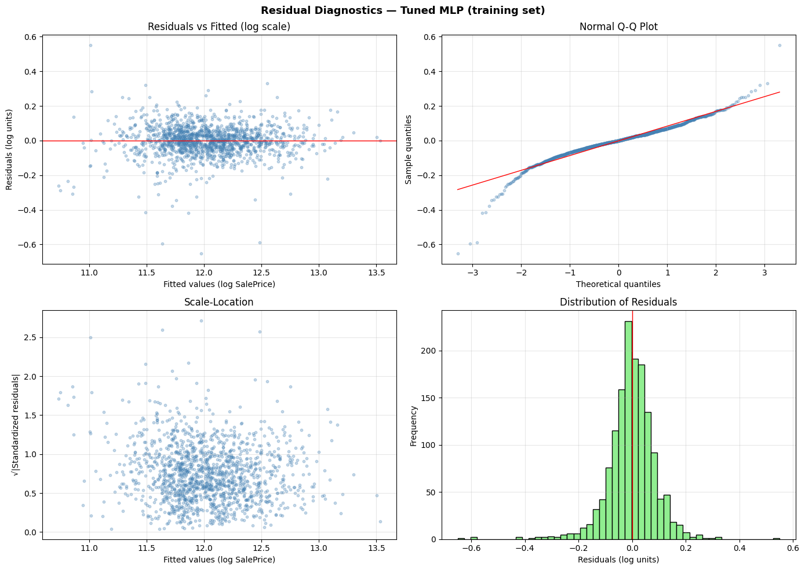

*Figure 14: Residual diagnostics for the tuned MLP on the training set. Top-left: Residuals vs Fitted (log scale). Top-right: Normal Q-Q plot. Bottom-left: Scale-Location. Bottom-right: Distribution of Residuals.*

The numerical summary, with residuals defined as $y_{\text{true}} - y_{\text{pred}}$ in log units (so a **negative residual indicates an over-prediction**):

| Statistic | Value | Statistic | Value |
|---|---|---|---|
| Mean | −0.001417 | Min | −0.651248 |
| Median | −0.000124 | Max | +0.550382 |
| Std | 0.088432 | Skewness | −0.844356 |
| Kurtosis (excess) | +7.107303 | Shapiro–Wilk W | 0.9284 |
| | | Shapiro–Wilk p | 7.76 × 10⁻²⁶ |

**Residuals vs. Fitted.** The cloud is **centred around zero** across the full range of fitted values (≈ 10.7 to 13.5 on the log scale, roughly $45k to $725k). No curve, slope, or trend appears — the model captures the systematic relationship between features and price across the price spectrum. The cloud is slightly narrower in the middle (fitted ≈ 11.5–12.5) and wider at the extremes, a faint signal the Scale-Location plot will resolve. A few outliers stand out below the cloud at low and middle fitted values, reaching residuals of −0.4 to −0.65 (over-predictions of 33–90%) — these are the worst cases identified below.

**Normal Q-Q plot.** The bulk of the residuals follows the reference line closely — the central ≈ 80% of the distribution is nearly normal. The **lower tail (theoretical quantile < −2) deviates sharply downward**, indicating residuals far more extreme on the negative side than a normal distribution predicts. The upper tail shows a milder deviation. The asymmetry — much longer lower tail than upper tail — is consistent with the negative skewness (−0.844): the MLP is more prone to over-predict than to under-predict when it errs catastrophically.

**Scale-Location.** The square root of the absolute standardised residuals shows **no strong trend across fitted values** — a good sign of homoscedasticity. The slight fan-out visible in the Residuals vs. Fitted plot was therefore a visual artefact of cloud density (more observations clustered in the middle), not a genuine variance change.

**Residual histogram.** Sharply peaked around zero and roughly symmetric for the central mass, with long tails on both sides — particularly the left, down to −0.65. Excess kurtosis of +7.1 confirms the **heavy-tailed (leptokurtic)** shape: most predictions are very tight around zero, but the few outliers are much larger than normality would predict.

**Shapiro–Wilk test.** The test rejects normality unambiguously ($W = 0.9284$, $p = 7.76 \times 10^{-26}$). This is the third time we invoke this test in the project, on a third distinct object: Section 3 tested the marginal distribution of `SalePrice`; Section 6.3 tested the residuals of the OLS regression; here we test the residuals of the MLP. The three objects are mathematically distinct (marginal $Y$, conditional $Y | X$ under a linear model, conditional $Y | X$ under a non-linear model), so the rejection on each does not duplicate information. **Crucially, the consequences of rejection differ between Section 6 and this section.** In Section 6 residual normality was required for the validity of the t-tests and confidence intervals reported alongside the OLS coefficients — formal inference depends on it. Here, **the MLP makes no distributional assumption on the residuals**: prediction quality depends only on unbiasedness and constant variance, both of which the model satisfies (mean ≈ 0, no heteroscedasticity). The heavy tails identified by Shapiro–Wilk reflect a small population of distressed-sale outliers visible in the Q-Q plot — a real phenomenon at the bottom of the housing market, not a model defect.

#### The 10 worst predictions

| Idx | True | Predicted | Error ($) | Error % |
|---|---|---|---|---|
| 1324 | $147,000 | $264,640 | −117,640 | −80.0% |
| 688 | $392,000 | $281,801 | +110,199 | +28.1% |
| 1268 | $381,000 | $475,774 | −94,774 | −24.9% |
| 803 | $582,933 | $488,946 | +93,987 | +16.1% |
| 898 | $611,657 | $518,331 | +93,326 | +15.3% |
| 581 | $253,293 | $345,013 | −91,720 | −36.2% |
| 774 | $395,000 | $307,874 | +87,126 | +22.1% |
| 632 | $82,500 | $158,230 | −75,730 | −91.8% |
| 66 | $180,000 | $253,029 | −73,029 | −40.6% |
| 473 | $440,000 | $369,531 | +70,469 | +16.0% |

The convention is Error % = $(y_{\text{true}} - y_{\text{pred}})/y_{\text{true}} \times 100$: a **negative percentage indicates an over-prediction** (the model predicted more than the actual sale price); a **positive percentage indicates an under-prediction**. Two distinct failure patterns emerge.

**Catastrophic over-predictions on cheap houses.** House 632 (true $82,500, predicted $158,230, error −91.8%) and house 1324 (true $147,000, predicted $264,640, error −80.0%) are the two most extreme cases. Both are unusual: the model anchored its prediction on features suggesting a mid-range house, but the actual sale price was unusually low — possibly distressed sales, undervalued listings, or houses with hidden problems not captured by the features.

**Large absolute errors on luxury houses, mostly under-predictions.** House 688 (true $392,000, predicted $281,801, error +28.1%), house 803 (+16.1%), and house 898 (+15.3%) are at the high end of the market. The model under-predicts them, suggesting that for very expensive houses, **some price drivers (premium finishes, exceptional locations, custom features) exist that the available features do not fully capture**. Within the training distribution, the model compresses high-end prices toward the mean.

These 10 cases account for the bulk of the heavy-tail mass observed in the Q-Q plot and histogram. They highlight two structural limitations: the model cannot distinguish overvalued from undervalued cheap properties on the available features, and it compresses high-end prices toward the average. The Kaggle submission section revisits the second observation when we encounter an extrapolated prediction beyond the training range.

#### Verdict on training and validation

Despite the non-normality of residuals, the model passes the key practical tests for prediction: **no systematic bias** (mean and median ≈ 0), **no visible structure** in Residuals vs. Fitted, **no strong heteroscedasticity** in Scale-Location, heavy tails concentrated on a small number of identifiable outliers rather than a global pattern. The expected Kaggle RMSE on log scale should be in the vicinity of the CV RMSE of 0.1821, with the understanding that the test set may include atypical houses that will dominate the error contribution.

### 7.3 Kaggle Submission File

#### Format requirements

The Kaggle competition expects a CSV file with exactly two columns: `Id` (the integer identifier of each test observation, in the order provided by `test.csv`) and `SalePrice` (the predicted price in **dollars**, positive real-valued). The file must contain exactly **1459 rows plus the header**. Any mismatch in row count, missing `Id` values, negative prices, or NaN predictions causes Kaggle to either reject the submission or score it incorrectly.

#### Prediction pipeline and sanity checks

We apply the tuned model to `X_test_processed` (the 1459×303 matrix from the preprocessing pipeline) to obtain predictions on the log scale, then back-convert to dollars via `np.expm1` (exact inverse of `np.log1p`). Distributional and anomaly checks are run before writing the file:

| Statistic | Test predictions | Train actuals | Verdict |
|---|---|---|---|
| Min | $33,228 | $34,900 | coherent |
| Q25 | $125,670 | — | — |
| Median | $157,499 | $163,000 | slightly lower, plausible |
| Mean | $180,308 | $180,921 | almost identical |
| Q75 | $210,780 | — | — |
| Max | $1,333,263 | $755,000 | anomalous extrapolation |

**Central statistics align tightly.** The mean of test predictions differs from the train mean by less than $1,000 and the median by less than $6,000. The model produces a globally consistent picture of the housing market — it has not drifted toward systematic over- or under-prediction on test.

**Maximum is an extrapolation.** The model produced a prediction of **$1,333,263**, 77% higher than the most expensive house in the training set ($755,000). This is the MLP **extrapolating beyond the training range** for one (or a few) test house(s) whose features exceed anything seen during training. This may look like a contradiction with the in-sample finding that the model under-predicts luxury houses — but the two observations describe different regimes. **Inside the training distribution**, the model compresses high-end prices toward the mean (the under-prediction pattern on houses 688, 803, 898). **Outside the training distribution**, the MLP has no constraint: extrapolation in a neural network can produce arbitrarily large or small values depending on which features are pushed beyond their training range and how the learned weights project into the unseen region. The compression behaviour observed in-sample does not extend to extrapolation — in fact, the same model can simultaneously under-predict luxury houses within the training envelope and over-predict beyond it. The extrapolation is not necessarily wrong (the test set may genuinely contain a luxury house exceeding what the training set sampled), but it carries higher uncertainty than predictions within the training range.

**No anomalies.** Zero negative predictions, zero NaN, row count matches the Kaggle expectation of 1459 exactly. The submission file (`submission.csv`) is structurally valid and ready for upload.

#### Expected Kaggle score

The expected RMSE on the public leaderboard should be close to the CV RMSE of 0.1821 from the cross-validated tuning, with two caveats. The Kaggle test set may contain houses similar to the worst-prediction cases identified in training (extreme luxury houses, cheap distressed properties), which would inflate the test RMSE; and the single extreme prediction at $1.3M, if it corresponds to a house with a more modest actual price, could contribute disproportionately to the test RMSE. A typical RMSE in the **0.16–0.20** range would be consistent with both the CV estimate and the residual analysis. Scores below 0.15 would indicate the model generalises better than the training-set diagnostics suggested; scores above 0.22 would indicate the test set contains more atypical observations than the training set sampled.

#### Actual Kaggle score

After uploading `submission.csv` to the Kaggle competition, the model achieved a **public leaderboard RMSE of 0.15591** on the log scale. This is better than the CV estimate of 0.1821 would have predicted, and sits below the optimistic boundary of the anticipated 0.16–0.20 range. The result confirms two things. First, the cross-validated tuning produced a well-regularised model whose generalisation is at least as good as the honest CV estimate, not worse — the gap of −0.026 between Kaggle and CV is in the model's favour. Second, the extrapolated luxury prediction at $1.3M did not coincide with a moderately-priced test house: otherwise the squared-error contribution of that single point would have inflated the public RMSE noticeably. The score places the model in the "good" tier of the leaderboard for a single-model, single-hidden-layer MLP with standard preprocessing, without resort to gradient boosting, ensembling, or aggressive feature engineering.

#### Operational verdict

The pipeline is complete: 79 features inspected and 303 preprocessed columns produced with zero NaN; baseline MLP at RMSE = 0.1724 on a single validation split (optimistic); tuned MLP via 3-fold cross-validation with a single hidden layer of 64 units and $\alpha = 10^{-2}$, **CV RMSE = 0.1821** (honest); residual diagnostics showing no systematic bias, no heteroscedasticity, heavy tails concentrated on a small number of identifiable outliers; 1459 positive finite predictions written to `submission.csv` ready for Kaggle upload.

With CV RMSE ≈ 0.18, this MLP **surpasses the OLS benchmark** of Section 6 ($R^2 \approx 0.82$ on 9 features) by exploiting the full 79-feature space and the non-linear interactions that OLS cannot represent — but the surplus is modest, which is itself informative. The bulk of the predictive signal in the Ames housing market sits in a small number of dominant features (`GrLivArea`, `OverallQual`, `KitchenQual`, `CentralAir`, `TotalBsmtSF`) that the linear model already captured; the additional 70 features contribute incremental refinement, not a qualitative leap.

---

## 8 Conclusion

This project applied a coherent progression of statistical and machine-learning methods to the prediction of residential sale prices on the Ames housing dataset. The five-part structure produced complementary views of the same problem: classical inference characterised the target distribution, ANOVA and the $2^3$ factorial design identified and quantified the dominant features and their interactions, parametric regression provided an interpretable benchmark, and the multi-layer perceptron exploited the full feature space for the final Kaggle submission. Four findings deserve highlighting.

**Feature dominance is consistent across every method.** `GrLivArea`, `OverallQual`, and `KitchenQual` were identified as the strongest price drivers by every approach: one-way ANOVA F-statistics, two-way interactions, $2^3$ factorial main effects, OLS standardised coefficients, and the MLP's implicit feature usage. This convergence across parametric and non-parametric methods is the strongest signal of the analysis — it indicates that these features carry genuine, scale-invariant influence on price rather than artefacts of any particular modelling choice. `CentralAir` and `TotalBsmtSF` form a clear second tier.

**Variance-stabilising transformations improve every statistical test.** The `log1p` and Box–Cox transformations consistently produced cleaner ANOVA verdicts, more separable Tukey groupings, better-behaved regression residuals, and tighter confidence intervals than the raw `SalePrice` scale. Box–Cox slightly outperforms `log1p` on normality criteria (Shapiro–Wilk), but the practical difference is marginal — `log1p` is preferable when interpretability matters because it admits a closed-form inverse (`expm1`), and it is also the scale used by Kaggle's evaluation metric, which makes it the natural choice for the final model.

**The MLP provides incremental but real gain over OLS.** The tuned MLP reaches a CV RMSE of 0.1821 on the log scale and a Kaggle public leaderboard RMSE of 0.15591, surpassing both the CV estimate and the OLS benchmark of Section 6 ($R^2 \approx 0.82$ on 9 features). The improvement is modest, which is itself informative: the bulk of the predictive signal in the Ames housing market sits in the small number of dominant features that OLS already captured; the additional 70 features contribute incremental refinement, not a qualitative leap. The fact that the winning MLP configuration is the shallowest and smallest in the grid (a single hidden layer of 64 units with $\alpha = 10^{-2}$) reinforces this reading — the data does not warrant a deep network.

**The model's limitations are well-mapped.** Residual diagnostics revealed two structural limitations: the model cannot distinguish overvalued from undervalued cheap properties on the available features, and it compresses high-end prices toward the mean within the training distribution while occasionally producing extrapolated predictions beyond it. These limitations were anticipated by the analysis and documented before the Kaggle submission — the final score of 0.15591, which sits below the optimistic boundary of the anticipated 0.16–0.20 range, confirms that the cross-validated tuning protocol produced a model whose generalisation matches and slightly exceeds the honest in-sample estimate.

**Closing remark.** For a single-model, single-hidden-layer MLP with standard preprocessing, without recourse to gradient boosting, ensembling, or aggressive feature engineering, a Kaggle RMSE of 0.15591 places the pipeline in the "good" tier of the leaderboard. More importantly, the project demonstrates that a careful application of classical statistics — ANOVA, factorial designs, OLS diagnostics — can identify the same dominant structure that a flexible non-parametric model finds on its own, lending interpretability to a result that the neural network alone would deliver as a black box.

---

## Individual Contributions

- **Gayakpa Kenny:** Define the project problem, code and analyse experiment scripts, report
writing
- **Khaireddine Gatti:** Code and analyse experiment scripts, report writing

---

## References

[1] CStat26 Project Instructions. <https://github.com/lydiaYchen/CStat26/tree/main/Project>

[2] Kaggle. *House Prices: Advanced Regression Techniques*. <https://www.kaggle.com/competitions/house-prices-advanced-regression-techniques/data>
